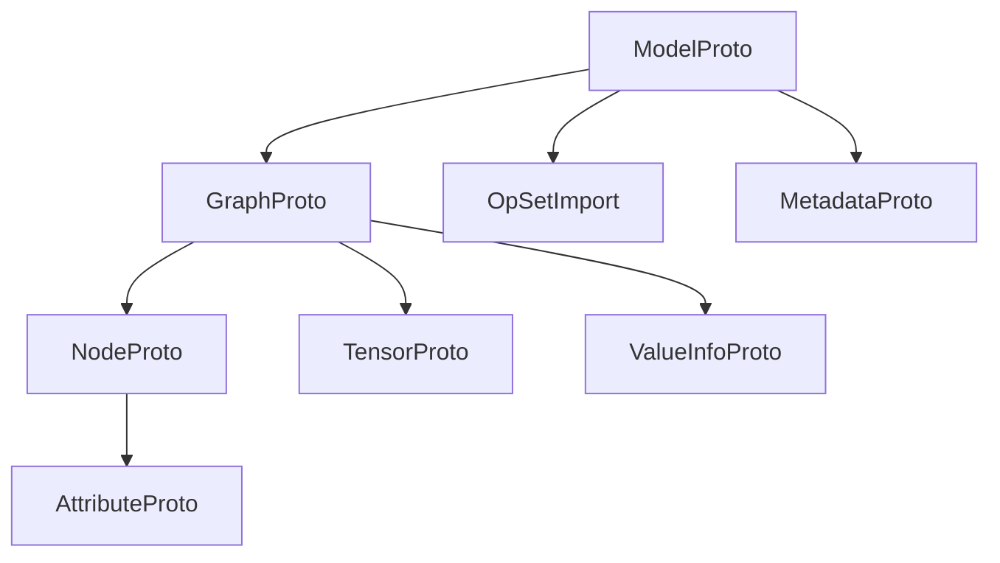
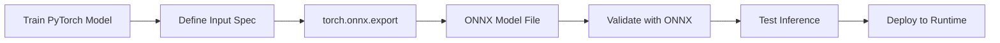
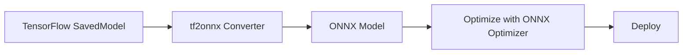
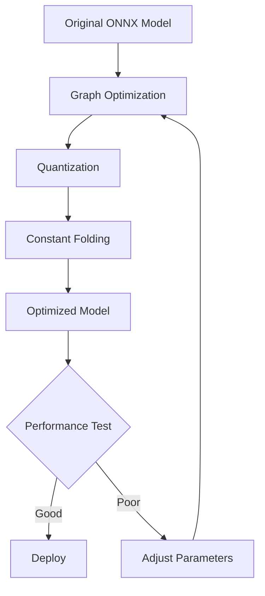

# ONNX (Open Neural Network Exchange)

**Document Version:** 1.0  
**Generated:** December 4, 2025  
**Standard Version:** ONNX 1.16  
**Status:** Widely Adopted Industry Standard

---

## Table of Contents

1. [Overview](#overview)
2. [Authoritative References](#authoritative-references)
3. [Format Structure](#format-structure)
4. [Procedural Use-Cases](#procedural-use-cases)
5. [ONNX Operators](#onnx-operators)
6. [Examples](#examples)
7. [Tools & Ecosystem](#tools--ecosystem)
8. [Best Practices](#best-practices)
9. [References](#references)

---

## Overview

**ONNX (Open Neural Network Exchange)** is an open format designed to represent machine learning models, enabling interoperability between different frameworks. ONNX defines a common computational graph representation and a set of standard operators that can be implemented by various ML frameworks and runtime engines.

### Key Features

- **Framework Interoperability**: Train in PyTorch, deploy in TensorFlow or vice versa
- **Hardware Optimization**: Optimized runtimes for CPUs, GPUs, and specialized accelerators
- **Versioned Operator Sets**: Backward-compatible evolution of operations
- **Extensible**: Custom operators and model metadata support
- **Binary Format**: Efficient serialization using Protocol Buffers

### Primary Use Cases

1. **Model Export**: Export trained models from ML frameworks
2. **Cross-Framework Deployment**: Use models across different ecosystems
3. **Optimization**: Apply framework-agnostic optimizations
4. **Production Serving**: Deploy to optimized inference engines
5. **Model Sharing**: Distribute pre-trained models in a universal format

---

## Authoritative References

### Official Specifications

- **ONNX GitHub Repository**: https://github.com/onnx/onnx
- **ONNX Specification**: https://github.com/onnx/onnx/blob/main/docs/IR.md
- **Operator Schemas**: https://github.com/onnx/onnx/blob/main/docs/Operators.md
- **ONNX Model Zoo**: https://github.com/onnx/models

### Standards Bodies

- **Linux Foundation AI & Data**: Hosts ONNX project
- **ONNX Steering Committee**: Governance and roadmap
- **Website**: https://onnx.ai/

### Version History

- **ONNX 1.0** (2017): Initial release
- **ONNX 1.5** (2019): Added training support
- **ONNX 1.10** (2021): Enhanced operator coverage
- **ONNX 1.16** (2024): Latest stable release

---

## Format Structure

ONNX models are serialized using **Protocol Buffers** (protobuf), a language-neutral, platform-neutral extensible mechanism for serializing structured data.

### Core Entities



### 1. ModelProto (Top-Level)

**Role**: Root container for the entire model.

**Key Attributes**:
- `ir_version`: ONNX IR version (currently 8)
- `opset_import`: Imported operator sets with versions
- `producer_name`: Framework that created the model (e.g., "pytorch", "tensorflow")
- `producer_version`: Version of the producing framework
- `graph`: The main computational graph (GraphProto)
- `metadata_props`: Key-value pairs for custom metadata

**Impact**: Defines compatibility and provenance of the model.

**Protobuf Definition**:
```protobuf
message ModelProto {
  optional int64 ir_version = 1;
  repeated OperatorSetIdProto opset_import = 8;
  optional string producer_name = 2;
  optional string producer_version = 3;
  optional string domain = 4;
  optional int64 model_version = 5;
  optional string doc_string = 6;
  optional GraphProto graph = 7;
  repeated StringStringEntryProto metadata_props = 14;
}
```

### 2. GraphProto (Computational Graph)

**Role**: Represents the computational graph structure.

**Key Attributes**:
- `node`: List of computation nodes (operations)
- `initializer`: Pre-initialized tensor values (weights, biases)
- `input`: Graph input specifications
- `output`: Graph output specifications
- `value_info`: Intermediate tensor type information

**Impact**: Defines the actual computation flow and data transformations.

**Protobuf Definition**:
```protobuf
message GraphProto {
  repeated NodeProto node = 1;
  optional string name = 2;
  repeated TensorProto initializer = 5;
  optional string doc_string = 10;
  repeated ValueInfoProto input = 11;
  repeated ValueInfoProto output = 12;
  repeated ValueInfoProto value_info = 13;
}
```

### 3. NodeProto (Operator Node)

**Role**: Represents a single operation in the graph.

**Key Attributes**:
- `op_type`: Operator name (e.g., "Conv", "MatMul", "Relu")
- `input`: List of input tensor names
- `output`: List of output tensor names
- `attribute`: Operator-specific parameters
- `domain`: Namespace for custom operators (empty for standard ops)

**Impact**: Defines individual computations and their connectivity.

**Protobuf Definition**:
```protobuf
message NodeProto {
  repeated string input = 1;
  repeated string output = 2;
  optional string name = 3;
  optional string op_type = 4;
  optional string domain = 7;
  repeated AttributeProto attribute = 5;
  optional string doc_string = 6;
}
```

### 4. TensorProto (Tensor Data)

**Role**: Stores tensor data (weights, constants).

**Key Attributes**:
- `dims`: Shape of the tensor
- `data_type`: Element data type (FLOAT, INT64, etc.)
- `raw_data`: Binary blob of tensor data
- `float_data`, `int64_data`, etc.: Type-specific data fields

**Impact**: Contains model parameters and constants.

**Protobuf Definition**:
```protobuf
message TensorProto {
  repeated int64 dims = 1;
  optional int32 data_type = 2;
  
  repeated float float_data = 4 [packed = true];
  repeated int32 int32_data = 5 [packed = true];
  repeated int64 int64_data = 7 [packed = true];
  optional bytes raw_data = 9;
  
  optional string name = 8;
  optional string doc_string = 12;
}
```

### 5. ValueInfoProto (Tensor Metadata)

**Role**: Describes tensor types and shapes.

**Abstract**: A `ValueInfoProto` is a lightweight descriptor that pairs a tensor's
name with its type signature (element type + shape). The runtime and optimiser use
these descriptors to validate connections between nodes and to pre-allocate buffers.

> Pseudocode:
> ```
> ValueInfo {
>   name  : string        // unique tensor identifier within the graph
>   type  : TypeProto      // element type (e.g. FLOAT) + shape (e.g. [batch, 3, 224, 224])
> }
> ```

**Key Attributes**:
- `name`: Tensor identifier
- `type`: Type information (tensor shape and element type)

**Impact**: Enables type checking and optimization.

**Concrete Usage**:
```python
from onnx import helper, TensorProto

# Declare a graph input: batch × 3 × 224 × 224 float tensor
input_info = helper.make_tensor_value_info(
    'input',              # tensor name
    TensorProto.FLOAT,    # element type
    [1, 3, 224, 224]      # shape (use None or strings for dynamic dims)
)

# Declare a graph output: batch × 1000 float tensor
output_info = helper.make_tensor_value_info(
    'output',
    TensorProto.FLOAT,
    [1, 1000]
)
```

### 6. AttributeProto (Operator Parameters)

**Role**: Stores operator-specific configuration.

**Abstract**: An `AttributeProto` is a typed key-value pair attached to a
`NodeProto`. It carries compile-time constants that control how the operator
behaves (e.g. kernel size for a convolution, axis for a softmax). Attributes are
**not** tensors flowing through the graph — they are fixed at model-build time.

> Pseudocode:
> ```
> Attribute {
>   name  : string              // e.g. "kernel_shape"
>   type  : enum { INT, FLOAT, STRING, TENSOR, ... }
>   value : int | float | string | tensor | list[…]
> }
> ```

**Key Attributes**:
- `name`: Parameter name (e.g., "kernel_shape", "strides")
- `type`: Attribute type (INT, FLOAT, STRING, TENSOR, etc.)
- Value fields: `i`, `f`, `s`, `t`, etc. depending on type

**Impact**: Configures operator behavior.

**Concrete Usage**:
```python
import onnx
from onnx import helper

# Attributes are set directly in make_node via keyword arguments
conv_node = helper.make_node(
    'Conv',
    inputs=['X', 'W'],
    outputs=['Y'],
    kernel_shape=[3, 3],     # AttributeProto(name="kernel_shape", type=INTS, ints=[3,3])
    strides=[1, 1],          # AttributeProto(name="strides",      type=INTS, ints=[1,1])
    pads=[1, 1, 1, 1],       # AttributeProto(name="pads",         type=INTS, ints=[1,1,1,1])
)

# You can also create an AttributeProto explicitly
attr = helper.make_attribute('axis', 1)   # integer attribute
print(attr)   # name: "axis"  type: INT  i: 1
```

---

## Procedural Use-Cases

### Use-Case 1: PyTorch to ONNX Export

**Goal**: Export a trained PyTorch model to ONNX format for deployment.

**Workflow**:



**Step-by-Step Procedure**:

1. **Train the Model**:
```python
import torch
import torch.nn as nn

class SimpleNet(nn.Module):
    def __init__(self):
        super().__init__()
        self.conv1 = nn.Conv2d(3, 64, kernel_size=3, padding=1)
        self.relu = nn.ReLU()
        self.fc = nn.Linear(64 * 32 * 32, 10)
    
    def forward(self, x):
        x = self.relu(self.conv1(x))
        x = x.view(x.size(0), -1)
        x = self.fc(x)
        return x

model = SimpleNet()
# ... training code ...
```

2. **Export to ONNX**:
```python
import torch.onnx

# Prepare dummy input matching expected shape
dummy_input = torch.randn(1, 3, 32, 32)

# Export
torch.onnx.export(
    model,                          # Model to export
    dummy_input,                    # Example input
    "simplenet.onnx",              # Output file
    export_params=True,             # Store trained weights
    opset_version=15,              # ONNX opset version
    do_constant_folding=True,      # Optimize constants
    input_names=['input'],         # Input tensor names
    output_names=['output'],       # Output tensor names
    dynamic_axes={                 # Variable batch size
        'input': {0: 'batch_size'},
        'output': {0: 'batch_size'}
    }
)
```

3. **Validate**:
```python
import onnx

# Load and check model
onnx_model = onnx.load("simplenet.onnx")
onnx.checker.check_model(onnx_model)
print("ONNX model is valid!")

# Print model info
print(onnx.helper.printable_graph(onnx_model.graph))
```

4. **Test Inference**:
```python
import onnxruntime as ort
import numpy as np

# Load ONNX model
session = ort.InferenceSession("simplenet.onnx")

# Prepare input
input_data = np.random.randn(1, 3, 32, 32).astype(np.float32)

# Run inference
outputs = session.run(
    None,  # Return all outputs
    {"input": input_data}
)

print("Output shape:", outputs[0].shape)
```

### Use-Case 2: TensorFlow to ONNX Conversion

**Goal**: Convert a TensorFlow SavedModel to ONNX.

**Workflow**:



**Procedure**:

1. **Save TensorFlow Model**:
```python
import tensorflow as tf

# Create and train model
model = tf.keras.Sequential([
    tf.keras.layers.Conv2D(32, 3, activation='relu', input_shape=(28, 28, 1)),
    tf.keras.layers.Flatten(),
    tf.keras.layers.Dense(10, activation='softmax')
])

# Train model...
# model.fit(...)

# Save as SavedModel
model.save('tf_model_saved')
```

2. **Convert to ONNX**:
```bash
python -m tf2onnx.convert \
    --saved-model tf_model_saved \
    --output model.onnx \
    --opset 15
```

3. **Optimize**:
```python
import onnx
from onnxoptimizer import optimize

# Load model
model = onnx.load("model.onnx")

# Apply optimizations
optimized_model = optimize(model, passes=[
    'eliminate_identity',
    'eliminate_nop_transpose',
    'fuse_bn_into_conv',
    'fuse_consecutive_transposes'
])

# Save optimized model
onnx.save(optimized_model, "model_optimized.onnx")
```

### Use-Case 3: Model Optimization Pipeline

**Goal**: Optimize ONNX model for inference performance.

**Workflow**:



**Optimization Techniques**:

1. **Graph Optimization**:
```python
from onnxruntime.transformers import optimizer

# Optimize transformer models
optimized_model = optimizer.optimize_model(
    "model.onnx",
    model_type='bert',
    num_heads=12,
    hidden_size=768
)
optimized_model.save_model_to_file("model_optimized.onnx")
```

2. **Quantization (INT8)**:
```python
import onnxruntime.quantization as quantization

# Dynamic quantization
quantization.quantize_dynamic(
    "model.onnx",
    "model_quantized.onnx",
    weight_type=quantization.QuantType.QInt8
)

# Static quantization (requires calibration data)
def calibration_data_reader():
    # Yield calibration batches
    for i in range(100):
        yield {"input": np.random.randn(1, 3, 224, 224).astype(np.float32)}

quantization.quantize_static(
    "model.onnx",
    "model_int8.onnx",
    calibration_data_reader()
)
```

---

## ONNX Operators

ONNX defines a comprehensive set of standard operators covering various neural network operations.

### Operator Categories

| Category | Operators | Use Cases |
|----------|-----------|-----------|
| **Neural Network** | Conv, MaxPool, BatchNormalization, Dropout | CNN layers |
| **Math** | Add, Sub, Mul, Div, MatMul, Gemm | Arithmetic operations |
| **Activation** | Relu, Sigmoid, Tanh, Softmax, Gelu | Non-linearities |
| **Reduction** | ReduceMean, ReduceSum, ArgMax, ArgMin | Aggregations |
| **Shape Manipulation** | Reshape, Transpose, Concat, Split | Tensor transformations |
| **Logical** | And, Or, Not, Equal, Greater | Boolean operations |
| **RNN** | LSTM, GRU, RNN | Recurrent networks |
| **Object Detection** | NMS, RoiAlign | Vision tasks |

### Key Operators in Detail

#### Conv (Convolution)

**Purpose**: 2D convolutional operation for image processing.

**Attributes**:
- `kernel_shape`: Filter dimensions [height, width]
- `strides`: Step size [stride_h, stride_w]
- `pads`: Padding [top, left, bottom, right]
- `dilations`: Dilation factors
- `group`: Number of groups (for grouped convolutions)

**Inputs**:
1. `X`: Input tensor [N, C_in, H, W]
2. `W`: Weight tensor [C_out, C_in/group, kernel_h, kernel_w]
3. `B`: Optional bias [C_out]

**Outputs**:
1. `Y`: Output tensor [N, C_out, H_out, W_out]

**Abstract — 2D Convolution**:
> 2D convolution slides a kernel (filter) over the spatial dimensions of the input,
> computing a weighted sum at each position. For a single output channel with no
> padding or stride, the operation is:
>
> $$\text{output}[y, x] = \sum_{ky} \sum_{kx} \text{input}[y + ky,\; x + kx] \times \text{kernel}[ky, kx]$$
>
> With multiple input/output channels and a bias term this generalises to:
>
> $$Y[n, c_{out}, y, x] = B[c_{out}] + \sum_{c_{in}} \sum_{ky} \sum_{kx} X[n, c_{in}, y{+}ky, x{+}kx] \times W[c_{out}, c_{in}, ky, kx]$$

**Example Node**:
```python
conv_node = onnx.helper.make_node(
    'Conv',
    inputs=['X', 'W', 'B'],
    outputs=['Y'],
    kernel_shape=[3, 3],
    pads=[1, 1, 1, 1],
    strides=[1, 1]
)
```

#### MatMul (Matrix Multiplication)

**Purpose**: General matrix multiplication.

**Inputs**:
1. `A`: Matrix [M, K]
2. `B`: Matrix [K, N]

**Outputs**:
1. `Y`: Result [M, N]

**Abstract — Matrix Multiplication**:
> Standard matrix multiply: each element of the result is the dot-product of a row
> of **A** with a column of **B**.
>
> $$C[i, j] = \sum_{k} A[i, k] \times B[k, j]$$
>
> Pseudocode:
> ```
> for i in 0..M:
>   for j in 0..N:
>     Y[i,j] = 0
>     for k in 0..K:
>       Y[i,j] += A[i,k] * B[k,j]
> ```

**Example**:
```python
matmul_node = onnx.helper.make_node(
    'MatMul',
    inputs=['A', 'B'],
    outputs=['Y']
)
```

#### Softmax

**Purpose**: Softmax activation for classification.

**Attributes**:
- `axis`: Dimension to apply softmax (default: -1)

**Formula**: $\text{softmax}(x_i) = \frac{e^{x_i}}{\sum_j e^{x_j}}$

**Example**:
```python
softmax_node = onnx.helper.make_node(
    'Softmax',
    inputs=['X'],
    outputs=['Y'],
    axis=1
)
```

---

## Examples

### Example 1: Complete ONNX Model (Pseudo-Binary Structure)

**Logical Structure** (for binary ONNX file):
```
ModelProto {
  ir_version: 8
  producer_name: "pytorch"
  producer_version: "2.0.0"
  opset_import {
    domain: ""
    version: 15
  }
  graph: GraphProto {
    name: "simple_classifier"
    node: [
      NodeProto {
        input: ["input", "conv_weight", "conv_bias"]
        output: ["conv_output"]
        op_type: "Conv"
        attribute: [
          {name: "kernel_shape", ints: [3, 3]},
          {name: "strides", ints: [1, 1]}
        ]
      },
      NodeProto {
        input: ["conv_output"]
        output: ["relu_output"]
        op_type: "Relu"
      },
      NodeProto {
        input: ["relu_output", "fc_weight", "fc_bias"]
        output: ["logits"]
        op_type: "Gemm"
      },
      NodeProto {
        input: ["logits"]
        output: ["output"]
        op_type: "Softmax"
        attribute: [{name: "axis", i: 1}]
      }
    ]
    initializer: [
      TensorProto {
        name: "conv_weight"
        dims: [64, 3, 3, 3]
        data_type: FLOAT
        raw_data: <binary blob>
      },
      TensorProto {
        name: "conv_bias"
        dims: [64]
        data_type: FLOAT
        raw_data: <binary blob>
      },
      TensorProto {
        name: "fc_weight"
        dims: [10, 64]
        data_type: FLOAT
        raw_data: <binary blob>
      },
      TensorProto {
        name: "fc_bias"
        dims: [10]
        data_type: FLOAT
        raw_data: <binary blob>
      }
    ]
    input: [
      ValueInfoProto {
        name: "input"
        type: {
          tensor_type: {
            elem_type: FLOAT
            shape: {dim: [{dim_param: "batch"}, {dim_value: 3}, {dim_value: 32}, {dim_value: 32}]}
          }
        }
      }
    ]
    output: [
      ValueInfoProto {
        name: "output"
        type: {
          tensor_type: {
            elem_type: FLOAT
            shape: {dim: [{dim_param: "batch"}, {dim_value: 10}]}
          }
        }
      }
    ]
  }
}
```

### Example 2: Creating ONNX Model Programmatically

**Python Code** (actual implementation):

```python
import onnx
from onnx import helper, TensorProto
import numpy as np

# Create input/output value info
input_info = helper.make_tensor_value_info(
    'input', TensorProto.FLOAT, [1, 3, 224, 224]
)
output_info = helper.make_tensor_value_info(
    'output', TensorProto.FLOAT, [1, 1000]
)

# Create weight tensors
conv_weight = np.random.randn(64, 3, 7, 7).astype(np.float32)
conv_weight_tensor = helper.make_tensor(
    'conv_weight',
    TensorProto.FLOAT,
    conv_weight.shape,
    conv_weight.flatten()
)

fc_weight = np.random.randn(1000, 64).astype(np.float32)
fc_weight_tensor = helper.make_tensor(
    'fc_weight',
    TensorProto.FLOAT,
    fc_weight.shape,
    fc_weight.flatten()
)

# Create nodes
conv_node = helper.make_node(
    'Conv',
    inputs=['input', 'conv_weight'],
    outputs=['conv_output'],
    kernel_shape=[7, 7],
    strides=[2, 2],
    pads=[3, 3, 3, 3]
)

relu_node = helper.make_node(
    'Relu',
    inputs=['conv_output'],
    outputs=['relu_output']
)

pool_node = helper.make_node(
    'GlobalAveragePool',
    inputs=['relu_output'],
    outputs=['pool_output']
)

flatten_node = helper.make_node(
    'Flatten',
    inputs=['pool_output'],
    outputs=['flatten_output']
)

fc_node = helper.make_node(
    'MatMul',
    inputs=['flatten_output', 'fc_weight'],
    outputs=['output']
)

# Create graph
graph = helper.make_graph(
    nodes=[conv_node, relu_node, pool_node, flatten_node, fc_node],
    name='simple_cnn',
    inputs=[input_info],
    outputs=[output_info],
    initializer=[conv_weight_tensor, fc_weight_tensor]
)

# Create model
model = helper.make_model(graph, producer_name='custom_builder')
model.opset_import[0].version = 15

# Check and save
onnx.checker.check_model(model)
onnx.save(model, 'custom_model.onnx')
print("Model created successfully!")
```

### Example 3: Model Inspection

**Inspecting ONNX Model** (actual code):

```python
import onnx

# Load model
model = onnx.load("model.onnx")

# Print basic info
print(f"IR Version: {model.ir_version}")
print(f"Producer: {model.producer_name} {model.producer_version}")
print(f"Opset Version: {model.opset_import[0].version}")

# Graph info
graph = model.graph
print(f"\nGraph Name: {graph.name}")
print(f"Number of Nodes: {len(graph.node)}")
print(f"Number of Initializers: {len(graph.initializer)}")

# Input/Output shapes
print("\nInputs:")
for input_tensor in graph.input:
    print(f"  {input_tensor.name}: {[d.dim_value or d.dim_param for d in input_tensor.type.tensor_type.shape.dim]}")

print("\nOutputs:")
for output_tensor in graph.output:
    print(f"  {output_tensor.name}: {[d.dim_value or d.dim_param for d in output_tensor.type.tensor_type.shape.dim]}")

# Node details
print("\nNodes:")
for node in graph.node:
    print(f"  {node.op_type}: {node.input} -> {node.output}")
    if node.attribute:
        for attr in node.attribute:
            print(f"    {attr.name}: {onnx.helper.get_attribute_value(attr)}")
```

### Example 4: ONNX Runtime Inference (Production)

**Abstract — Inference Pipeline Pseudocode**:
> The general ONNX Runtime inference workflow follows four stages:
>
> ```
> function run_inference(model_path, input_data):
>     // 1. LOAD — deserialise the ONNX protobuf and build an in-memory graph
>     session = LoadModel(model_path)
>
>     // 2. CONFIGURE — choose execution provider and optimisation level
>     session.set_providers(["CUDA", "CPU"])   // GPU first, CPU fallback
>     session.set_optimization(LEVEL_ALL)       // fuse ops, eliminate dead nodes
>
>     // 3. RUN — bind inputs, execute the optimised graph, collect outputs
>     outputs = session.run(output_names, {input_name: input_data})
>
>     // 4. RETURN — post-process and return predictions
>     return post_process(outputs)
> ```

**Optimized Inference** (actual code):

```python
import onnxruntime as ort
import numpy as np

class ONNXInferenceEngine:
    def __init__(self, model_path, use_gpu=False):
        # Set execution providers
        providers = ['CUDAExecutionProvider', 'CPUExecutionProvider'] if use_gpu else ['CPUExecutionProvider']
        
        # Create session with options
        sess_options = ort.SessionOptions()
        sess_options.graph_optimization_level = ort.GraphOptimizationLevel.ORT_ENABLE_ALL
        sess_options.intra_op_num_threads = 4
        
        self.session = ort.InferenceSession(
            model_path,
            sess_options=sess_options,
            providers=providers
        )
        
        # Get input/output metadata
        self.input_name = self.session.get_inputs()[0].name
        self.output_name = self.session.get_outputs()[0].name
        self.input_shape = self.session.get_inputs()[0].shape
        
    def predict(self, input_data):
        """Run inference on input data"""
        # Ensure correct dtype
        if not isinstance(input_data, np.ndarray):
            input_data = np.array(input_data)
        if input_data.dtype != np.float32:
            input_data = input_data.astype(np.float32)
        
        # Run inference
        outputs = self.session.run(
            [self.output_name],
            {self.input_name: input_data}
        )
        
        return outputs[0]
    
    def batch_predict(self, batch_data, batch_size=32):
        """Efficient batch inference"""
        results = []
        for i in range(0, len(batch_data), batch_size):
            batch = batch_data[i:i+batch_size]
            batch_array = np.array(batch, dtype=np.float32)
            output = self.predict(batch_array)
            results.append(output)
        return np.concatenate(results, axis=0)

# Usage
engine = ONNXInferenceEngine("model.onnx", use_gpu=True)

# Single inference
input_data = np.random.randn(1, 3, 224, 224).astype(np.float32)
prediction = engine.predict(input_data)
print(f"Prediction shape: {prediction.shape}")

# Batch inference
batch_data = [np.random.randn(3, 224, 224) for _ in range(100)]
batch_predictions = engine.batch_predict(batch_data, batch_size=16)
print(f"Batch predictions shape: {batch_predictions.shape}")
```

---

## Tools & Ecosystem

### Model Conversion Tools

| Tool | Description | Homepage |
|------|-------------|----------|
| **PyTorch** | Native ONNX export via torch.onnx | https://pytorch.org/docs/stable/onnx.html |
| **TensorFlow (tf2onnx)** | TF/Keras to ONNX converter | https://github.com/onnx/tensorflow-onnx |
| **ONNX-TensorFlow** | Bi-directional TF↔ONNX | https://github.com/onnx/onnx-tensorflow |
| **sklearn-onnx** | Scikit-learn to ONNX | https://github.com/onnx/sklearn-onnx |
| **CoreML Tools** | CoreML↔ONNX conversion | https://github.com/apple/coremltools |
| **Keras2onnx** | Keras to ONNX | https://github.com/onnx/keras-onnx |

### Runtime & Inference

| Tool | Description | Homepage |
|------|-------------|----------|
| **ONNX Runtime** | Microsoft's cross-platform inference engine | https://onnxruntime.ai/ |
| **TensorRT** | NVIDIA's high-performance inference | https://developer.nvidia.com/tensorrt |
| **OpenVINO** | Intel's inference toolkit | https://docs.openvino.ai/ |
| **ONNX.js** | Browser-based inference | https://github.com/microsoft/onnxjs |
| **MXNet** | Apache MXNet with ONNX support | https://mxnet.apache.org/ |

### Optimization & Validation

| Tool | Description | Homepage |
|------|-------------|----------|
| **ONNX Optimizer** | Graph optimization passes | https://github.com/onnx/optimizer |
| **ONNX Simplifier** | Simplify ONNX models | https://github.com/daquexian/onnx-simplifier |
| **Netron** | Neural network visualizer | https://netron.app/ |
| **ONNX Checker** | Model validation (built-in) | Part of ONNX package |

### Model Repositories

| Repository | Description | Homepage |
|------------|-------------|----------|
| **ONNX Model Zoo** | Official pre-trained models | https://github.com/onnx/models |
| **Hugging Face Hub** | Community models (many ONNX) | https://huggingface.co/models |
| **ONNX Model Hub** | Curated model collection | https://onnx.ai/models |

---

## Best Practices

### 1. Version Management

```python
# Always specify opset version explicitly
torch.onnx.export(
    model,
    dummy_input,
    "model.onnx",
    opset_version=15  # Use latest stable opset
)
```

### 2. Dynamic Shapes

```python
# Enable dynamic batch size for flexibility
dynamic_axes = {
    'input': {0: 'batch_size'},
    'output': {0: 'batch_size'}
}

torch.onnx.export(
    model, dummy_input, "model.onnx",
    dynamic_axes=dynamic_axes
)
```

### 3. Model Validation

```python
import onnx

# Always validate after export
model = onnx.load("model.onnx")
onnx.checker.check_model(model)

# Check for potential issues
from onnx import shape_inference
inferred_model = shape_inference.infer_shapes(model)
```

### 4. Performance Testing

```python
import time
import numpy as np

# Benchmark inference
def benchmark(session, input_data, num_runs=100):
    # Warmup
    for _ in range(10):
        session.run(None, {session.get_inputs()[0].name: input_data})
    
    # Measure
    start = time.time()
    for _ in range(num_runs):
        session.run(None, {session.get_inputs()[0].name: input_data})
    end = time.time()
    
    avg_time = (end - start) / num_runs * 1000  # ms
    print(f"Average inference time: {avg_time:.2f} ms")

session = ort.InferenceSession("model.onnx")
input_data = np.random.randn(1, 3, 224, 224).astype(np.float32)
benchmark(session, input_data)
```

### 5. Metadata Management

```python
# Add model metadata
model.metadata_props.append(
    onnx.StringStringEntryProto(key="description", value="Image classifier")
)
model.metadata_props.append(
    onnx.StringStringEntryProto(key="author", value="ML Team")
)
model.metadata_props.append(
    onnx.StringStringEntryProto(key="license", value="Apache-2.0")
)
```

---

## References

### Official Documentation
- ONNX GitHub: https://github.com/onnx/onnx
- ONNX Tutorials: https://github.com/onnx/tutorials
- ONNX Runtime Docs: https://onnxruntime.ai/docs/

### Related Standards
- **Protocol Buffers**: https://protobuf.dev/
- **Model Cards**: See [04-Model-Cards.md](./04-Model-Cards.md)
- **Vector Embeddings**: See [A01-Vector-Embeddings-Standards.md](../annexes/A01-Vector-Embeddings-Standards.md)

### Community Resources
- ONNX Slack: https://lfaifoundation.slack.com/
- ONNX Working Groups: https://github.com/onnx/onnx/blob/main/community/readme.md

---

**Navigation**: [Back to Index](../INDEX.md) | [Previous: Neural Networks Fundamentals](./01-Neural-Networks-Fundamentals.md) | [Next: OpenAPI for AI Services](./03-OpenAPI-AI-Services.md)
