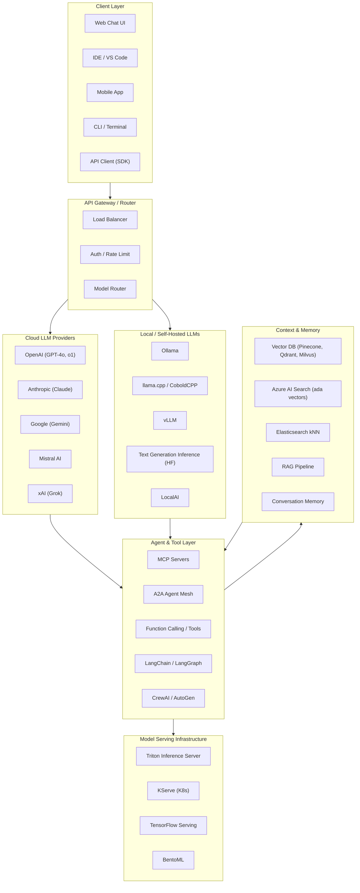
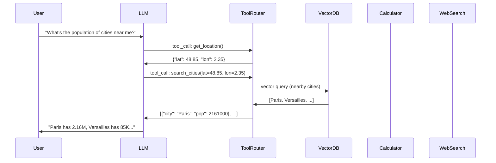
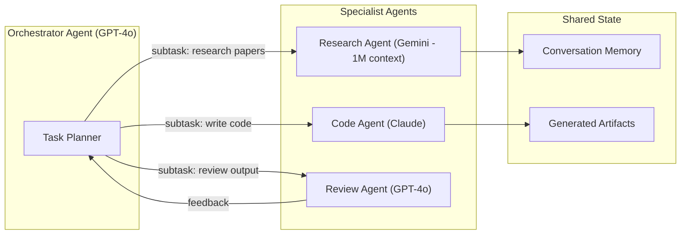
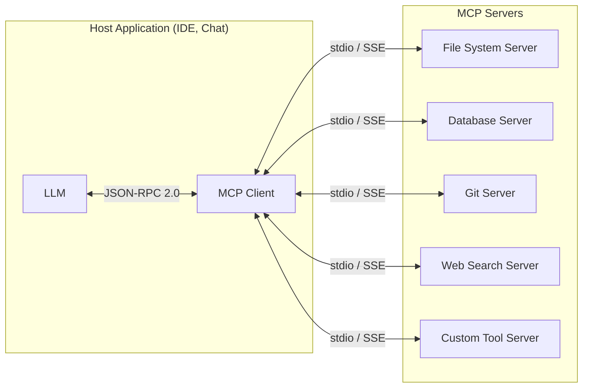
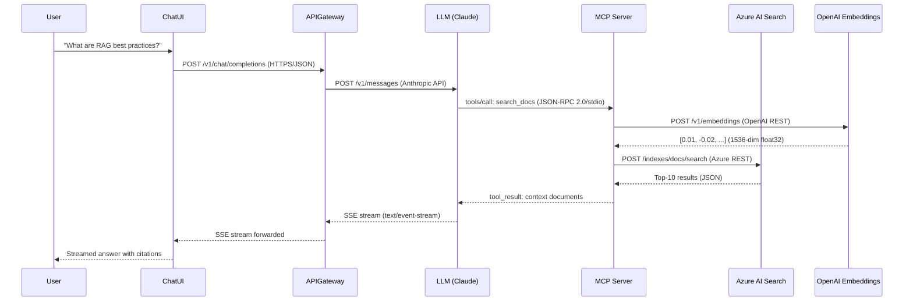
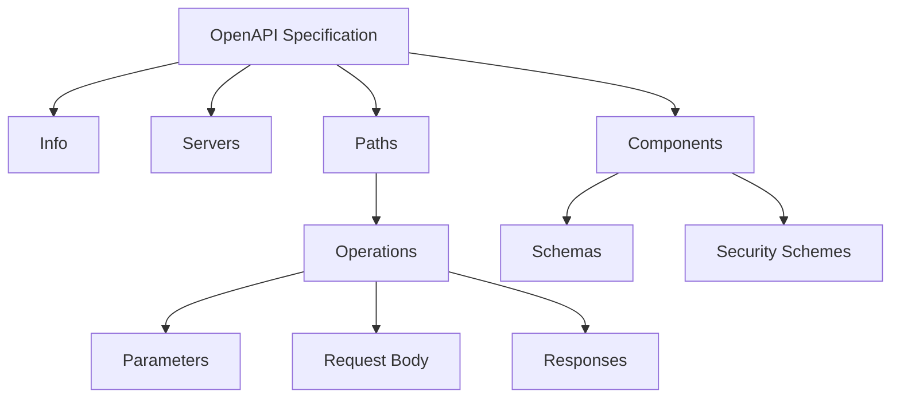
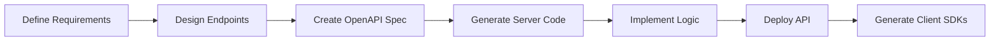
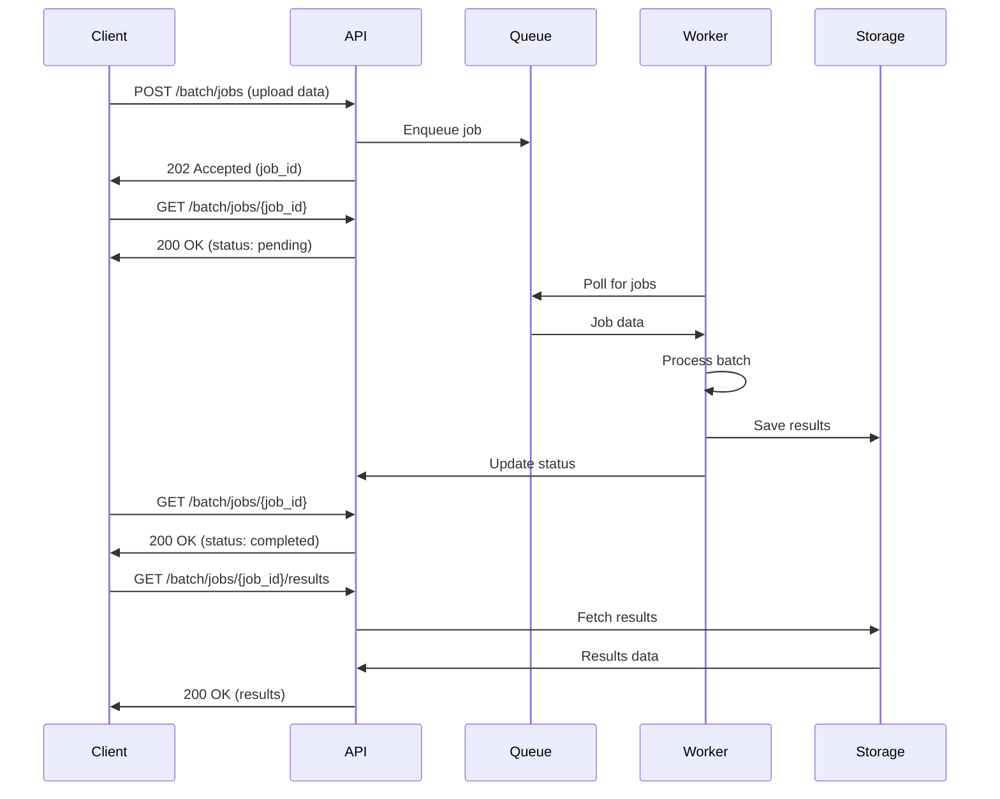

# OpenAPI for AI Services

**Document Version:** 2.0  
**Generated:** December 4, 2025 | **Updated:** February 22, 2026  
**Standard Version:** OpenAPI 3.1  
**Status:** Industry Standard for REST APIs

---

## Table of Contents

1. [Overview](#overview)
2. [AI System Architecture & Interconnection Patterns](#ai-system-architecture--interconnection-patterns)
3. [Authoritative References](#authoritative-references)
4. [Format Structure](#format-structure)
5. [LLM Provider API Protocols — Comparative Reference](#llm-provider-api-protocols--comparative-reference)
6. [Local LLM Frameworks & Their Protocols](#local-llm-frameworks--their-protocols)
7. [Agent-to-Agent & Tool Protocols](#agent-to-agent--tool-protocols)
8. [Vector & Context Service Protocols](#vector--context-service-protocols)
9. [Procedural Use-Cases](#procedural-use-cases)
10. [AI-Specific Patterns](#ai-specific-patterns)
11. [Examples](#examples)
12. [Tools & Ecosystem](#tools--ecosystem)
13. [Best Practices](#best-practices)

---

## Overview

**OpenAPI Specification (OAS)**, formerly known as Swagger, is a standard for defining REST API interfaces in a machine-readable format. For AI services, OpenAPI provides a structured way to document and implement ML model serving endpoints, inference APIs, and AI service integrations.

### Key Features

- **Language-Agnostic**: Framework and language-independent API descriptions
- **Auto-Documentation**: Generate interactive API documentation automatically
- **Code Generation**: Create client SDKs and server stubs in multiple languages
- **Validation**: Request/response schema validation
- **Versioning**: Track API changes and maintain backward compatibility

### Primary Use Cases for AI

1. **Model Serving APIs**: Document inference endpoints
2. **ML Platform APIs**: Experiment tracking, model registry access
3. **AI Service Integration**: Third-party AI service consumption
4. **Batch Prediction APIs**: Async inference endpoints
5. **Model Management**: CRUD operations for models

---

## Authoritative References

### Official Specifications

- **OpenAPI Specification**: https://spec.openapis.org/oas/latest.html
- **OpenAPI Initiative**: https://www.openapis.org/
- **GitHub Repository**: https://github.com/OAI/OpenAPI-Specification
- **Model Context Protocol (MCP)**: https://modelcontextprotocol.io/
- **Agent2Agent (A2A) Protocol**: https://google.github.io/A2A/
- **OpenAI API Reference**: https://platform.openai.com/docs/api-reference
- **Anthropic API Reference**: https://docs.anthropic.com/en/docs/about-claude/models
- **Google Gemini API**: https://ai.google.dev/api/rest
- **Mistral API**: https://docs.mistral.ai/api/
- **xAI Grok API**: https://docs.x.ai/api
- **Azure OpenAI Service**: https://learn.microsoft.com/en-us/azure/ai-services/openai/
- **Azure AI Search (Vector)**: https://learn.microsoft.com/en-us/azure/search/vector-search-overview

### Version History

- **OpenAPI 3.0** (2017): Major redesign from Swagger 2.0
- **OpenAPI 3.1** (2021): JSON Schema alignment, webhooks support

### Standards Bodies

- **OpenAPI Initiative (OAI)**: Under Linux Foundation
- **Contributors**: Google, Microsoft, IBM, Amazon, and others

---

## AI System Architecture & Interconnection Patterns

This section describes the **higher-level architectural patterns** used in modern AI systems — how LLMs, clients, tools, vector databases, and external services interconnect, and the **protocols and interfaces** used between them.

**Guiding Perspective:**

Think of the system as two planes that must align:

- **Control plane**: routing, auth, policies, and model selection.
- **Data plane**: the actual token, tool, and retrieval traffic.

Most production incidents happen when these planes drift (e.g., routing sends a request to a model that doesn’t support tools, or streaming is enabled but the client expects JSON). The diagram below shows the typical **flow of control and data** so you can reason about where a failure or latency spike is introduced.

### High-Level Architecture Overview



### Protocol Matrix — What Connects to What

| Connection | Protocol | Format | Transport | Auth | Latency |
|-----------|----------|--------|-----------|------|---------|
| Client ↔ Cloud LLM | OpenAI-compatible REST | JSON | HTTPS | Bearer / API Key | 200ms–10s |
| Client ↔ Local LLM (Ollama) | OpenAI-compatible REST | JSON | HTTP | None (local) | 50ms–5s |
| Client ↔ llama.cpp/CoboldCPP | OpenAI-compatible REST | JSON | HTTP | None (local) | 50ms–5s |
| LLM ↔ Tools (Function Calling) | Inline JSON in chat | JSON | Embedded | N/A | 0ms |
| LLM ↔ MCP Server | JSON-RPC 2.0 over stdio/SSE | JSON | stdio / HTTP+SSE | OAuth 2.0 | 10ms–200ms |
| Agent ↔ Agent (A2A) | HTTPS REST + JSON-RPC | JSON | HTTPS | OAuth 2.0 | 50ms–500ms |
| App ↔ Vector DB (Pinecone) | REST API | JSON | HTTPS | API Key | 10ms–100ms |
| App ↔ Azure AI Search | REST API | JSON | HTTPS | API Key / AAD | 20ms–200ms |
| App ↔ Elasticsearch kNN | REST API | JSON | HTTPS | Basic / API Key | 10ms–100ms |
| App ↔ Vector DB (Milvus) | gRPC + REST | Protobuf/JSON | HTTP/2 | Token | 5ms–50ms |
| Client ↔ Model Serving (Triton) | gRPC / REST | Protobuf/JSON | HTTP/2 | None/mTLS | 1ms–50ms |
| Client ↔ KServe | REST (V2 protocol) | JSON | HTTPS | K8s RBAC | 5ms–100ms |
| LLM ↔ Streaming response | SSE (Server-Sent Events) | text/event-stream | HTTPS | Bearer | Continuous |

### Pattern 1: Multi-LLM Router (Cloud)

A common production pattern routes requests to different LLM providers based on cost, capability, or latency requirements.

**Abstract Example — Router Decision Logic:**
```

**How to read this diagram:**

- Requests enter from the **client layer**, pass through an **API gateway/router**, then fan out to cloud or local LLMs.
- Tool calls and retrieval happen **mid-flight**, often as part of a tool-using agent loop.
- Vector stores and search services provide **context**; serving stacks provide **model inference** for specialized tasks.

Each line in the protocol matrix below is a **contract boundary** that should be explicitly documented in OpenAPI (for REST) or in protobuf/IDL (for gRPC). That is why the matrix is presented before provider-specific protocols.
INPUT: user_request, model_preference, budget_tier
OUTPUT: response from selected provider

PROCEDURE:
  IF model_preference is specified THEN
    provider = ResolveProvider(model_preference)
  ELSE IF budget_tier == "economy" THEN
    provider = SelectCheapest([GPT-4o-mini, Claude-Haiku, Mistral-Small])
  ELSE IF task_requires_vision THEN
    provider = SelectCapable([GPT-4o, Claude-Sonnet, Gemini-Pro])
  ELSE IF context_length > 100K THEN
    provider = SelectLongContext([Claude-Opus (200K), Gemini-Pro (1M)])
  ELSE
    provider = SelectBalanced(cost, quality, latency)
  END IF
  
  response = CallProvider(provider, user_request)
  
  IF response.failed THEN
    response = Fallback(next_provider, user_request)
  END IF
  
  RETURN response
```

**Concrete Example — Python Multi-Provider Router:**
```python
import os
from openai import OpenAI
import anthropic
import google.generativeai as genai

class MultiLLMRouter:
    """Routes requests to optimal LLM provider."""
    
    def __init__(self):
        self.openai = OpenAI(api_key=os.getenv("OPENAI_API_KEY"))
        self.anthropic = anthropic.Anthropic(api_key=os.getenv("ANTHROPIC_API_KEY"))
        genai.configure(api_key=os.getenv("GOOGLE_API_KEY"))
        self.gemini = genai.GenerativeModel("gemini-1.5-pro")
        # Mistral uses OpenAI-compatible endpoint
        self.mistral = OpenAI(
            api_key=os.getenv("MISTRAL_API_KEY"),
            base_url="https://api.mistral.ai/v1"
        )
        # Grok uses OpenAI-compatible endpoint
        self.grok = OpenAI(
            api_key=os.getenv("XAI_API_KEY"),
            base_url="https://api.x.ai/v1"
        )
    
    def route(self, prompt: str, provider: str = "auto",
              max_tokens: int = 1024) -> str:
        """Route to best provider."""
        
        if provider == "openai" or provider == "auto":
            return self._call_openai(prompt, max_tokens)
        elif provider == "anthropic":
            return self._call_anthropic(prompt, max_tokens)
        elif provider == "gemini":
            return self._call_gemini(prompt, max_tokens)
        elif provider == "mistral":
            return self._call_mistral(prompt, max_tokens)
        elif provider == "grok":
            return self._call_grok(prompt, max_tokens)
    
    def _call_openai(self, prompt: str, max_tokens: int) -> str:
        response = self.openai.chat.completions.create(
            model="gpt-4o",
            messages=[{"role": "user", "content": prompt}],
            max_tokens=max_tokens
        )
        return response.choices[0].message.content
    
    def _call_anthropic(self, prompt: str, max_tokens: int) -> str:
        message = self.anthropic.messages.create(
            model="claude-sonnet-4-20250514",
            max_tokens=max_tokens,
            messages=[{"role": "user", "content": prompt}]
        )
        return message.content[0].text
    
    def _call_gemini(self, prompt: str, max_tokens: int) -> str:
        response = self.gemini.generate_content(
            prompt,
            generation_config={"max_output_tokens": max_tokens}
        )
        return response.text
    
    def _call_mistral(self, prompt: str, max_tokens: int) -> str:
        # Mistral uses OpenAI-compatible API
        response = self.mistral.chat.completions.create(
            model="mistral-large-latest",
            messages=[{"role": "user", "content": prompt}],
            max_tokens=max_tokens
        )
        return response.choices[0].message.content
    
    def _call_grok(self, prompt: str, max_tokens: int) -> str:
        # Grok uses OpenAI-compatible API
        response = self.grok.chat.completions.create(
            model="grok-2",
            messages=[{"role": "user", "content": prompt}],
            max_tokens=max_tokens
        )
        return response.choices[0].message.content

# Usage
router = MultiLLMRouter()
answer = router.route("Explain transformers", provider="anthropic")
```

### Pattern 2: LLM + Tool Chain (Function Calling)

LLMs call external tools through a structured protocol embedded in the chat API.

**Architecture:**


**Abstract Protocol — Tool Definition Schema:**
```json
{
  "tool_definition": {
    "name": "<tool_name>",
    "description": "<what the tool does>",
    "parameters": {
      "type": "object",
      "properties": {
        "<param_name>": {
          "type": "<json_type>",
          "description": "<param_description>"
        }
      },
      "required": ["<required_params>"]
    }
  },
  "tool_call": {
    "id": "<unique_call_id>",
    "name": "<tool_name>",
    "arguments": "{\"<param>\": \"<value>\"}"
  },
  "tool_result": {
    "tool_call_id": "<unique_call_id>",
    "content": "<result_string>"
  }
}
```

### Pattern 3: Multi-LLM Cooperation (Agent Mesh)

Multiple LLMs cooperate on complex tasks, each specializing in a sub-task.

**Architecture Patterns:**



**Concrete Example — CrewAI Multi-Agent:**
```python
from crewai import Agent, Task, Crew
from langchain_openai import ChatOpenAI

# Define specialist agents using different LLMs
researcher = Agent(
    role="Research Specialist",
    goal="Find and summarize relevant technical papers",
    backstory="Expert at finding academic papers and extracting key findings",
    llm=ChatOpenAI(model="gpt-4o", temperature=0.3)
)

coder = Agent(
    role="Implementation Engineer",
    goal="Write clean, tested Python code",
    backstory="Senior Python developer who writes production-quality code",
    llm=ChatOpenAI(
        model="claude-sonnet-4-20250514",
        base_url="https://api.anthropic.com/v1",  # via adapter
    )
)

reviewer = Agent(
    role="Code Reviewer",
    goal="Review code for bugs, security issues, and best practices",
    backstory="Principal engineer who catches subtle bugs",
    llm=ChatOpenAI(model="gpt-4o", temperature=0.1)
)

# Define tasks
research_task = Task(
    description="Research best practices for implementing RAG systems",
    agent=researcher
)

code_task = Task(
    description="Implement a RAG pipeline based on the research findings",
    agent=coder,
    context=[research_task]  # depends on research output
)

review_task = Task(
    description="Review the RAG implementation for correctness and security",
    agent=reviewer,
    context=[code_task]
)

# Execute crew
crew = Crew(
    agents=[researcher, coder, reviewer],
    tasks=[research_task, code_task, review_task],
    verbose=True
)
result = crew.kickoff()
```

---

## LLM Provider API Protocols — Comparative Reference

### The OpenAI Chat Completions Protocol (De Facto Standard)

Most LLM providers and local frameworks have adopted the **OpenAI Chat Completions API format** as the de facto standard. This section documents the exact protocol structure used across providers.

**Guiding Principle (Base Pattern + Nuances):**

At a high level, all providers accept **a list of messages** and return **assistant text or tool calls**. The **base principle** is consistent; the **nuances** are in the fields and streaming formats:

- **Base principle**: `messages[]` → model → `choices[]` response
- **Nuances**: auth headers, endpoint paths, streaming event shapes, tool-calling schema differences, and context-length limits

If you standardize your own internal request/response shape, you can adapt to these nuances at the gateway layer (e.g., with a provider adapter or a proxy).

**Universal Endpoint Pattern:**
```
POST /v1/chat/completions
Content-Type: application/json
Authorization: Bearer <api_key>
```

### Provider-Specific Endpoints & Authentication

| Provider | Base URL | Auth Header | Model Examples |
|----------|----------|-------------|----------------|
| **OpenAI** | `https://api.openai.com/v1` | `Authorization: Bearer sk-...` | gpt-4o, gpt-4o-mini, o1 |
| **Azure OpenAI** | `https://{resource}.openai.azure.com/openai/deployments/{model}/` | `api-key: ...` | gpt-4o (deployed) |
| **Anthropic** | `https://api.anthropic.com/v1` | `x-api-key: sk-ant-...` + `anthropic-version: 2023-06-01` | claude-sonnet-4-20250514, claude-opus-4-20250514 |
| **Google Gemini** | `https://generativelanguage.googleapis.com/v1beta` | `x-goog-api-key: ...` | gemini-1.5-pro, gemini-2.0-flash |
| **Mistral** | `https://api.mistral.ai/v1` | `Authorization: Bearer ...` | mistral-large-latest, codestral |
| **xAI Grok** | `https://api.x.ai/v1` | `Authorization: Bearer xai-...` | grok-2, grok-2-mini |
| **Ollama (local)** | `http://localhost:11434/v1` | None | llama3.2, mistral, phi3 |
| **llama.cpp** | `http://localhost:8080/v1` | None | loaded GGUF model |
| **CoboldCPP** | `http://localhost:5001/v1` | None | loaded GGUF model |
| **vLLM** | `http://localhost:8000/v1` | None | any HF model |
| **LM Studio** | `http://localhost:1234/v1` | None | loaded model |

### OpenAI-Compatible Request/Response (Universal Format)

**Request** (works identically across OpenAI, Mistral, Grok, Ollama, llama.cpp, vLLM, LM Studio):
```json
{
  "model": "gpt-4o",
  "messages": [
    {"role": "system", "content": "You are a helpful assistant."},
    {"role": "user", "content": "What is machine learning?"}
  ],
  "temperature": 0.7,
  "max_tokens": 1024,
  "top_p": 1.0,
  "stream": false,
  "tools": [],
  "response_format": {"type": "text"}
}
```

**Response:**
```json
{
  "id": "chatcmpl-abc123",
  "object": "chat.completion",
  "created": 1709078400,
  "model": "gpt-4o",
  "choices": [{
    "index": 0,
    "message": {
      "role": "assistant",
      "content": "Machine learning is a subset of AI..."
    },
    "finish_reason": "stop"
  }],
  "usage": {
    "prompt_tokens": 25,
    "completion_tokens": 150,
    "total_tokens": 175
  }
}
```

### Anthropic Messages API (Different Format)

Anthropic uses a different API structure (NOT OpenAI-compatible natively):

**Request:**
```json
{
  "model": "claude-sonnet-4-20250514",
  "max_tokens": 1024,
  "system": "You are a helpful assistant.",
  "messages": [
    {"role": "user", "content": "What is machine learning?"}
  ],
  "temperature": 0.7
}
```

**Key Differences from OpenAI:**
- `system` is a top-level field, not a message
- Response wraps content in typed blocks `[{"type": "text", "text": "..."}]`
- Uses `stop_reason` instead of `finish_reason`
- Uses `input_tokens`/`output_tokens` instead of `prompt_tokens`/`completion_tokens`
- Tool use returns `{"type": "tool_use", "id": "...", "name": "...", "input": {...}}`

### Google Gemini API (Different Format)

**Endpoint:**
```
POST https://generativelanguage.googleapis.com/v1beta/models/gemini-1.5-pro:generateContent?key=API_KEY
```

**Request:**
```json
{
  "contents": [
    {
      "role": "user",
      "parts": [{"text": "What is machine learning?"}]
    }
  ],
  "generationConfig": {
    "temperature": 0.7,
    "maxOutputTokens": 1024,
    "topP": 0.95,
    "topK": 40
  },
  "systemInstruction": {
    "parts": [{"text": "You are a helpful assistant."}]
  }
}
```

**Response:**
```json
{
  "candidates": [{
    "content": {
      "role": "model",
      "parts": [{"text": "Machine learning is a subset of AI..."}]
    },
    "finishReason": "STOP",
    "safetyRatings": [...]
  }],
  "usageMetadata": {
    "promptTokenCount": 25,
    "candidatesTokenCount": 150,
    "totalTokenCount": 175
  }
}
```

**Key Differences from OpenAI:**
- Uses `contents` array with `parts` (supports multimodal: text, image, audio, video)
- Uses `generationConfig` instead of flat parameters
- Uses `candidates` instead of `choices`
- Safety ratings included in every response
- System instruction is a separate top-level field

### Streaming Protocol (SSE — Server-Sent Events)

All major providers use SSE for streaming. The wire format varies:

**OpenAI / Mistral / Grok SSE Stream:**
```
data: {"id":"chatcmpl-abc","object":"chat.completion.chunk","choices":[{"index":0,"delta":{"content":"Machine"},"finish_reason":null}]}

data: {"id":"chatcmpl-abc","object":"chat.completion.chunk","choices":[{"index":0,"delta":{"content":" learning"},"finish_reason":null}]}

data: {"id":"chatcmpl-abc","object":"chat.completion.chunk","choices":[{"index":0,"delta":{},"finish_reason":"stop"}]}

data: [DONE]
```

**Anthropic SSE Stream:**
```
event: message_start
data: {"type":"message_start","message":{"id":"msg_abc","type":"message","role":"assistant","content":[],"model":"claude-sonnet-4-20250514"}}

event: content_block_start
data: {"type":"content_block_start","index":0,"content_block":{"type":"text","text":""}}

event: content_block_delta
data: {"type":"content_block_delta","index":0,"delta":{"type":"text_delta","text":"Machine"}}

event: content_block_delta
data: {"type":"content_block_delta","index":0,"delta":{"type":"text_delta","text":" learning"}}

event: message_stop
data: {"type":"message_stop"}
```

**Key Difference:** Anthropic uses typed events (`message_start`, `content_block_delta`, `message_stop`) while OpenAI uses a flat `data:` stream terminated by `data: [DONE]`.

---

## Local LLM Frameworks & Their Protocols

### Overview of Local Inference Frameworks

Local frameworks allow running LLMs on personal hardware. Most adopt the OpenAI-compatible API.

| Framework | Language | GPU Support | API Compatibility | Quantization | Key Feature |
|-----------|----------|-------------|-------------------|--------------|-------------|
| **Ollama** | Go | CUDA, Metal, ROCm | OpenAI-compatible | GGUF (Q4, Q5, Q8) | Easiest setup |
| **llama.cpp** | C/C++ | CUDA, Metal, Vulkan | OpenAI-compatible | GGUF (all levels) | Fastest CPU inference |
| **CoboldCPP** | C++ (llama.cpp fork) | CUDA, CLBlast, Vulkan | OpenAI + KoboldAI API | GGUF, GPTQ | Multi-model, UI |
| **vLLM** | Python | CUDA | OpenAI-compatible | AWQ, GPTQ, SqueezeLLM | PagedAttention, throughput |
| **LocalAI** | Go | CUDA, Metal | OpenAI-compatible | GGUF, GPTQ | Drop-in OpenAI replacement |
| **LM Studio** | Electron | CUDA, Metal | OpenAI-compatible | GGUF | Desktop GUI |
| **TGI (HuggingFace)** | Rust/Python | CUDA | Custom + OpenAI-compat | AWQ, GPTQ, EETQ | Production serving |

### Ollama API Examples

**List models:**
```bash
GET http://localhost:11434/api/tags
```

**Generate (Ollama native):**
```json
POST http://localhost:11434/api/generate
{
  "model": "llama3.2",
  "prompt": "What is machine learning?",
  "stream": false
}
```

**Chat (OpenAI-compatible):**
```json
POST http://localhost:11434/v1/chat/completions
{
  "model": "llama3.2",
  "messages": [
    {"role": "user", "content": "What is machine learning?"}
  ]
}
```

**Python — Switching Between Cloud and Local (same code):**
```python
from openai import OpenAI

# Cloud: OpenAI
cloud_client = OpenAI(api_key="sk-...")

# Local: Ollama (identical API!)
local_client = OpenAI(
    base_url="http://localhost:11434/v1",
    api_key="unused"  # Ollama ignores this
)

# Same code works for both!
def ask(client, model, prompt):
    response = client.chat.completions.create(
        model=model,
        messages=[{"role": "user", "content": prompt}]
    )
    return response.choices[0].message.content

# Cloud
print(ask(cloud_client, "gpt-4o", "Explain RAG"))

# Local
print(ask(local_client, "llama3.2", "Explain RAG"))
```

### CoboldCPP / KoboldAI API

CoboldCPP exposes both OpenAI-compatible and its own KoboldAI API:

**KoboldAI native endpoint:**
```json
POST http://localhost:5001/api/v1/generate
{
  "prompt": "Once upon a time",
  "max_context_length": 4096,
  "max_length": 200,
  "temperature": 0.7,
  "top_p": 0.9,
  "rep_pen": 1.1,
  "stop_sequence": ["\n\n"]
}
```

**Response:**
```json
{
  "results": [
    {"text": ", in a land far away, there lived a..."}
  ]
}
```

**CoboldCPP also serves OpenAI-compatible at `/v1/chat/completions`**, making it interchangeable with any OpenAI SDK client.

### vLLM OpenAI-Compatible Server

```bash
# Start vLLM server
python -m vllm.entrypoints.openai.api_server \
    --model meta-llama/Llama-3-8b-chat-hf \
    --host 0.0.0.0 \
    --port 8000
```

```python
# Client code — identical to OpenAI
from openai import OpenAI
client = OpenAI(base_url="http://localhost:8000/v1", api_key="unused")

response = client.chat.completions.create(
    model="meta-llama/Llama-3-8b-chat-hf",
    messages=[{"role": "user", "content": "Hello!"}]
)
```

---

## Agent-to-Agent & Tool Protocols

### Model Context Protocol (MCP)

**MCP** is an open standard (by Anthropic) that enables LLMs to access external tools, data sources, and services through a standardized interface. Think of it as "USB for AI" — a universal connector.

**Architecture:**


**Protocol: JSON-RPC 2.0 over stdio or HTTP+SSE**

**Abstract — MCP Capability Discovery:**
```json
// Client → Server: Initialize
{
  "jsonrpc": "2.0",
  "id": 1,
  "method": "initialize",
  "params": {
    "protocolVersion": "2024-11-05",
    "capabilities": {
      "roots": {"listChanged": true}
    },
    "clientInfo": {"name": "my-app", "version": "1.0"}
  }
}

// Server → Client: Capabilities response
{
  "jsonrpc": "2.0",
  "id": 1,
  "result": {
    "protocolVersion": "2024-11-05",
    "capabilities": {
      "tools": {"listChanged": true},
      "resources": {"subscribe": true},
      "prompts": {"listChanged": true}
    },
    "serverInfo": {"name": "file-server", "version": "1.0"}
  }
}
```

**Concrete — MCP Tool Definition & Call:**
```json
// List tools available
{"jsonrpc": "2.0", "id": 2, "method": "tools/list"}

// Server response
{
  "jsonrpc": "2.0", "id": 2,
  "result": {
    "tools": [
      {
        "name": "read_file",
        "description": "Read contents of a file",
        "inputSchema": {
          "type": "object",
          "properties": {
            "path": {"type": "string", "description": "File path to read"}
          },
          "required": ["path"]
        }
      },
      {
        "name": "search_database",
        "description": "Search vector database for relevant documents",
        "inputSchema": {
          "type": "object",
          "properties": {
            "query": {"type": "string"},
            "top_k": {"type": "integer", "default": 5}
          },
          "required": ["query"]
        }
      }
    ]
  }
}

// Call a tool
{
  "jsonrpc": "2.0", "id": 3,
  "method": "tools/call",
  "params": {
    "name": "read_file",
    "arguments": {"path": "/data/report.md"}
  }
}

// Tool result
{
  "jsonrpc": "2.0", "id": 3,
  "result": {
    "content": [
      {"type": "text", "text": "# Report\nThis is the report content..."}
    ]
  }
}
```

**Python MCP Server Implementation:**
```python
from mcp.server import Server
from mcp.types import Tool, TextContent
import mcp.server.stdio

app = Server("my-tools")

@app.list_tools()
async def list_tools():
    return [
        Tool(
            name="calculate",
            description="Evaluate a math expression",
            inputSchema={
                "type": "object",
                "properties": {
                    "expression": {"type": "string"}
                },
                "required": ["expression"]
            }
        )
    ]

@app.call_tool()
async def call_tool(name: str, arguments: dict):
    if name == "calculate":
        result = eval(arguments["expression"])
        return [TextContent(type="text", text=str(result))]

async def main():
    async with mcp.server.stdio.stdio_server() as (read, write):
        await app.run(read, write, app.create_initialization_options())
```

### Agent2Agent Protocol (A2A) — Google

**A2A** enables AI agents to discover and communicate with each other over HTTPS. Each agent publishes an **Agent Card** (like a business card) describing its capabilities.

**Agent Card (Discovery):**
```json
GET https://agent.example.com/.well-known/agent.json

{
  "name": "Research Agent",
  "description": "Finds and summarizes academic papers",
  "url": "https://agent.example.com",
  "version": "1.0",
  "capabilities": {
    "streaming": true,
    "pushNotifications": false
  },
  "skills": [
    {
      "id": "paper-search",
      "name": "Academic Paper Search",
      "description": "Search arXiv and Semantic Scholar for papers"
    }
  ],
  "authentication": {
    "schemes": ["OAuth2"]
  }
}
```

**A2A Task Execution:**
```json
// Send task to agent
POST https://agent.example.com/tasks/send
{
  "jsonrpc": "2.0",
  "id": "task-001",
  "method": "tasks/send",
  "params": {
    "id": "task-001",
    "message": {
      "role": "user",
      "parts": [
        {"type": "text", "text": "Find papers about RAG evaluation metrics"}
      ]
    }
  }
}

// Agent responds (may stream)
{
  "jsonrpc": "2.0",
  "id": "task-001",
  "result": {
    "id": "task-001",
    "status": {"state": "completed"},
    "artifacts": [
      {
        "name": "search-results",
        "parts": [
          {"type": "text", "text": "Found 15 papers on RAG evaluation..."}
        ]
      }
    ]
  }
}
```

---

## Vector & Context Service Protocols

### Azure AI Search — Vector Protocol

Azure AI Search provides vector search using the **ada-002** embedding format (1536 dimensions) or any custom embedding model.

**Abstract — Vector Search Flow:**
```
1. Application generates embeddings via OpenAI ada-002 or custom model
2. Upserts vectors + metadata to Azure AI Search index
3. At query time: embed query → vector search → return ranked results
4. Results feed into RAG pipeline as context for LLM
```

**Concrete — Create Vector Index:**
```json
PUT https://{service-name}.search.windows.net/indexes/documents?api-version=2024-07-01
Content-Type: application/json
api-key: {admin-key}

{
  "name": "documents",
  "fields": [
    {"name": "id", "type": "Edm.String", "key": true},
    {"name": "content", "type": "Edm.String", "searchable": true},
    {"name": "category", "type": "Edm.String", "filterable": true},
    {
      "name": "contentVector",
      "type": "Collection(Edm.Single)",
      "searchable": true,
      "vectorSearchDimensions": 1536,
      "vectorSearchProfileName": "hnsw-profile"
    }
  ],
  "vectorSearch": {
    "algorithms": [
      {
        "name": "hnsw-config",
        "kind": "hnsw",
        "hnswParameters": {
          "m": 4,
          "efConstruction": 400,
          "efSearch": 500,
          "metric": "cosine"
        }
      }
    ],
    "profiles": [
      {
        "name": "hnsw-profile",
        "algorithmConfigurationName": "hnsw-config"
      }
    ]
  }
}
```

**Concrete — Vector Search Query:**
```json
POST https://{service-name}.search.windows.net/indexes/documents/docs/search?api-version=2024-07-01
{
  "count": true,
  "select": "id, content, category",
  "vectorQueries": [
    {
      "kind": "vector",
      "vector": [0.01, -0.02, 0.03, ...],
      "fields": "contentVector",
      "k": 10
    }
  ],
  "filter": "category eq 'technical'"
}
```

**Python — Azure AI Search with ada-002 Embeddings:**
```python
from azure.search.documents import SearchClient
from azure.search.documents.models import VectorizedQuery
from openai import AzureOpenAI
from azure.core.credentials import AzureKeyCredential

# Generate embedding using Azure OpenAI (ada-002)
aoai_client = AzureOpenAI(
    azure_endpoint="https://my-openai.openai.azure.com/",
    api_key="...",
    api_version="2024-02-15-preview"
)

def get_embedding(text: str) -> list:
    response = aoai_client.embeddings.create(
        model="text-embedding-ada-002",  # or text-embedding-3-large
        input=text
    )
    return response.data[0].embedding

# Search Azure AI Search
search_client = SearchClient(
    endpoint="https://my-search.search.windows.net",
    index_name="documents",
    credential=AzureKeyCredential("...")
)

query_vector = get_embedding("How does RAG work?")

results = search_client.search(
    search_text=None,
    vector_queries=[
        VectorizedQuery(
            vector=query_vector,
            k_nearest_neighbors=10,
            fields="contentVector"
        )
    ],
    select=["id", "content", "category"]
)

for result in results:
    print(f"Score: {result['@search.score']:.4f}")
    print(f"Content: {result['content'][:200]}")
```

### Elasticsearch kNN Vector Search

**Index mapping with dense_vector:**
```json
PUT /documents
{
  "mappings": {
    "properties": {
      "content": {"type": "text"},
      "embedding": {
        "type": "dense_vector",
        "dims": 1536,
        "index": true,
        "similarity": "cosine"
      }
    }
  }
}
```

**kNN search query:**
```json
POST /documents/_search
{
  "knn": {
    "field": "embedding",
    "query_vector": [0.01, -0.02, 0.03, ...],
    "k": 10,
    "num_candidates": 100
  },
  "fields": ["content"]
}
```

### Protocol Summary — Full AI System Request Flow

**End-to-end RAG flow with all protocols labeled:**


---

## Format Structure

OpenAPI specifications are typically written in **YAML** or **JSON**.

### Core Components



### 1. Info Object

**Role**: Metadata about the API.

**Key Fields**:
- `title`: API name
- `version`: API version
- `description`: Detailed API description
- `contact`: Maintainer information
- `license`: License details

**Example**:
```yaml
info:
  title: Image Classification API
  version: 1.0.0
  description: Real-time image classification using deep learning models
  contact:
    name: AI Team
    email: ai-team@example.com
  license:
    name: Apache 2.0
    url: https://www.apache.org/licenses/LICENSE-2.0.html
```

### 2. Servers Object

**Role**: Defines API server URLs.

**Example**:
```yaml
servers:
  - url: https://api.example.com/v1
    description: Production server
  - url: https://staging-api.example.com/v1
    description: Staging server
  - url: http://localhost:8000/v1
    description: Development server
```

### 3. Paths Object

**Role**: Defines available endpoints and operations.

**Structure**:
```yaml
paths:
  /predict:
    post:
      summary: Make a prediction
      operationId: predict
      requestBody:
        required: true
        content:
          application/json:
            schema:
              $ref: '#/components/schemas/PredictionRequest'
      responses:
        '200':
          description: Successful prediction
          content:
            application/json:
              schema:
                $ref: '#/components/schemas/PredictionResponse'
```

### 4. Components Object

**Role**: Reusable definitions (schemas, parameters, responses).

**Schemas** (data models):
```yaml
components:
  schemas:
    PredictionRequest:
      type: object
      required:
        - image
      properties:
        image:
          type: string
          format: byte
          description: Base64-encoded image
        model_id:
          type: string
          description: Model identifier
          default: "resnet50"
    
    PredictionResponse:
      type: object
      properties:
        predictions:
          type: array
          items:
            $ref: '#/components/schemas/Prediction'
        inference_time_ms:
          type: number
          format: float
    
    Prediction:
      type: object
      properties:
        class_name:
          type: string
        class_id:
          type: integer
        confidence:
          type: number
          format: float
          minimum: 0
          maximum: 1
```

### 5. Security Schemes

**Role**: Authentication and authorization mechanisms.

**Example**:
```yaml
components:
  securitySchemes:
    ApiKeyAuth:
      type: apiKey
      in: header
      name: X-API-Key
    
    BearerAuth:
      type: http
      scheme: bearer
      bearerFormat: JWT

security:
  - ApiKeyAuth: []
  - BearerAuth: []
```

---

## Procedural Use-Cases

### Use-Case 1: Designing an Image Classification API

**Goal**: Create a REST API for image classification with OpenAPI documentation.

**Workflow**:



**Step-by-Step Procedure**:

1. **Define API Specification**:

```yaml
openapi: 3.1.0
info:
  title: Image Classification API
  version: 1.0.0
  description: |
    Deep learning-based image classification service.
    Supports multiple model architectures and real-time inference.

servers:
  - url: https://api.mlplatform.com/v1

paths:
  /models:
    get:
      summary: List available models
      operationId: listModels
      tags:
        - Models
      responses:
        '200':
          description: List of available models
          content:
            application/json:
              schema:
                type: array
                items:
                  $ref: '#/components/schemas/ModelInfo'
  
  /classify:
    post:
      summary: Classify an image
      operationId: classifyImage
      tags:
        - Inference
      requestBody:
        required: true
        content:
          multipart/form-data:
            schema:
              type: object
              properties:
                file:
                  type: string
                  format: binary
                model:
                  type: string
                  default: resnet50
                top_k:
                  type: integer
                  minimum: 1
                  maximum: 10
                  default: 5
      responses:
        '200':
          description: Classification results
          content:
            application/json:
              schema:
                $ref: '#/components/schemas/ClassificationResult'
        '400':
          description: Invalid input
          content:
            application/json:
              schema:
                $ref: '#/components/schemas/Error'
        '500':
          description: Internal server error
          content:
            application/json:
              schema:
                $ref: '#/components/schemas/Error'
      security:
        - ApiKeyAuth: []

components:
  schemas:
    ModelInfo:
      type: object
      properties:
        id:
          type: string
          example: resnet50
        name:
          type: string
          example: ResNet-50
        description:
          type: string
        input_shape:
          type: array
          items:
            type: integer
          example: [224, 224, 3]
        classes:
          type: integer
          example: 1000
    
    ClassificationResult:
      type: object
      properties:
        predictions:
          type: array
          items:
            type: object
            properties:
              class_name:
                type: string
                example: "golden_retriever"
              class_id:
                type: integer
                example: 207
              confidence:
                type: number
                format: float
                example: 0.9523
        model_used:
          type: string
          example: "resnet50"
        inference_time_ms:
          type: number
          format: float
          example: 45.2
    
    Error:
      type: object
      properties:
        error:
          type: string
        message:
          type: string
        status_code:
          type: integer
  
  securitySchemes:
    ApiKeyAuth:
      type: apiKey
      in: header
      name: X-API-Key
```

2. **Generate Server Stub** (using FastAPI):

```python
from fastapi import FastAPI, File, UploadFile, HTTPException, Security
from fastapi.security.api_key import APIKeyHeader
from pydantic import BaseModel, Field
from typing import List
import time

app = FastAPI(
    title="Image Classification API",
    version="1.0.0",
    description="Deep learning-based image classification service"
)

# Security
api_key_header = APIKeyHeader(name="X-API-Key", auto_error=True)

def verify_api_key(api_key: str = Security(api_key_header)):
    if api_key != "your-secret-key":
        raise HTTPException(status_code=403, detail="Invalid API Key")
    return api_key

# Models
class Prediction(BaseModel):
    class_name: str
    class_id: int
    confidence: float = Field(ge=0, le=1)

class ClassificationResult(BaseModel):
    predictions: List[Prediction]
    model_used: str
    inference_time_ms: float

class ModelInfo(BaseModel):
    id: str
    name: str
    description: str
    input_shape: List[int]
    classes: int

# Endpoints
@app.get("/models", response_model=List[ModelInfo])
def list_models():
    return [
        ModelInfo(
            id="resnet50",
            name="ResNet-50",
            description="50-layer residual network",
            input_shape=[224, 224, 3],
            classes=1000
        )
    ]

@app.post("/classify", response_model=ClassificationResult)
async def classify_image(
    file: UploadFile = File(...),
    model: str = "resnet50",
    top_k: int = 5,
    api_key: str = Security(verify_api_key)
):
    start_time = time.time()
    
    # Read image
    image_bytes = await file.read()
    
    # Run inference (placeholder)
    predictions = [
        Prediction(class_name="golden_retriever", class_id=207, confidence=0.9523),
        Prediction(class_name="labrador_retriever", class_id=208, confidence=0.0321),
    ]
    
    inference_time = (time.time() - start_time) * 1000
    
    return ClassificationResult(
        predictions=predictions[:top_k],
        model_used=model,
        inference_time_ms=inference_time
    )
```

3. **Generate Client SDK** (Python):

```python
import requests
from typing import List, Dict

class ImageClassificationClient:
    def __init__(self, base_url: str, api_key: str):
        self.base_url = base_url
        self.headers = {"X-API-Key": api_key}
    
    def list_models(self) -> List[Dict]:
        """Get list of available models"""
        response = requests.get(
            f"{self.base_url}/models",
            headers=self.headers
        )
        response.raise_for_status()
        return response.json()
    
    def classify(self, image_path: str, model: str = "resnet50", 
                 top_k: int = 5) -> Dict:
        """Classify an image"""
        with open(image_path, 'rb') as f:
            files = {'file': f}
            params = {'model': model, 'top_k': top_k}
            
            response = requests.post(
                f"{self.base_url}/classify",
                headers=self.headers,
                files=files,
                params=params
            )
        
        response.raise_for_status()
        return response.json()

# Usage
client = ImageClassificationClient(
    "https://api.mlplatform.com/v1",
    "your-api-key"
)

# List models
models = client.list_models()
print(f"Available models: {[m['id'] for m in models]}")

# Classify image
result = client.classify("dog.jpg", model="resnet50", top_k=3)
print(f"Top prediction: {result['predictions'][0]['class_name']} "
      f"({result['predictions'][0]['confidence']:.2%})")
```

### Use-Case 2: Text Generation API (LLM Service)

**Goal**: Design an API for text generation services.

**OpenAPI Specification**:

```yaml
openapi: 3.1.0
info:
  title: Text Generation API
  version: 2.0.0
  description: Large Language Model text generation service

paths:
  /generate:
    post:
      summary: Generate text completion
      requestBody:
        required: true
        content:
          application/json:
            schema:
              type: object
              required:
                - prompt
              properties:
                prompt:
                  type: string
                  description: Input text prompt
                  example: "Write a poem about AI:"
                max_tokens:
                  type: integer
                  minimum: 1
                  maximum: 2048
                  default: 100
                temperature:
                  type: number
                  format: float
                  minimum: 0
                  maximum: 2
                  default: 0.7
                  description: Sampling temperature (higher = more random)
                top_p:
                  type: number
                  format: float
                  minimum: 0
                  maximum: 1
                  default: 1.0
                  description: Nucleus sampling threshold
                stop:
                  type: array
                  items:
                    type: string
                  description: Stop sequences
                  example: ["\n", "END"]
      responses:
        '200':
          description: Generated text
          content:
            application/json:
              schema:
                type: object
                properties:
                  generated_text:
                    type: string
                  tokens_used:
                    type: integer
                  finish_reason:
                    type: string
                    enum: [length, stop, error]

  /generate/stream:
    post:
      summary: Stream text generation
      requestBody:
        $ref: '#/paths/~1generate/post/requestBody'
      responses:
        '200':
          description: Server-sent events stream
          content:
            text/event-stream:
              schema:
                type: object
                properties:
                  token:
                    type: string
                  done:
                    type: boolean
```

**Implementation** (FastAPI with streaming):

```python
from fastapi import FastAPI
from fastapi.responses import StreamingResponse
from pydantic import BaseModel, Field
import asyncio
import json

app = FastAPI()

class GenerateRequest(BaseModel):
    prompt: str
    max_tokens: int = Field(100, ge=1, le=2048)
    temperature: float = Field(0.7, ge=0, le=2)
    top_p: float = Field(1.0, ge=0, le=1)
    stop: List[str] = Field(default_factory=list)

class GenerateResponse(BaseModel):
    generated_text: str
    tokens_used: int
    finish_reason: str

@app.post("/generate", response_model=GenerateResponse)
async def generate(request: GenerateRequest):
    # Simulated generation
    generated = f"{request.prompt} [Generated text with {request.max_tokens} tokens]"
    
    return GenerateResponse(
        generated_text=generated,
        tokens_used=len(generated.split()),
        finish_reason="length"
    )

@app.post("/generate/stream")
async def generate_stream(request: GenerateRequest):
    async def event_generator():
        tokens = ["This", " is", " a", " streamed", " response"]
        for token in tokens:
            await asyncio.sleep(0.1)  # Simulate generation delay
            yield f"data: {json.dumps({'token': token, 'done': False})}\n\n"
        yield f"data: {json.dumps({'token': '', 'done': True})}\n\n"
    
    return StreamingResponse(
        event_generator(),
        media_type="text/event-stream"
    )
```

### Use-Case 3: Batch Prediction API

**Goal**: Design an asynchronous batch prediction service.

**Workflow**:



**OpenAPI Specification**:

```yaml
paths:
  /batch/jobs:
    post:
      summary: Create batch prediction job
      requestBody:
        required: true
        content:
          application/json:
            schema:
              type: object
              properties:
                input_data:
                  type: array
                  items:
                    type: object
                model_id:
                  type: string
      responses:
        '202':
          description: Job accepted
          content:
            application/json:
              schema:
                type: object
                properties:
                  job_id:
                    type: string
                    format: uuid
                  status:
                    type: string
                    enum: [pending, processing, completed, failed]

  /batch/jobs/{job_id}:
    get:
      summary: Get job status
      parameters:
        - name: job_id
          in: path
          required: true
          schema:
            type: string
            format: uuid
      responses:
        '200':
          description: Job status
          content:
            application/json:
              schema:
                type: object
                properties:
                  job_id:
                    type: string
                  status:
                    type: string
                  created_at:
                    type: string
                    format: date-time
                  progress:
                    type: number
                    format: float
                    minimum: 0
                    maximum: 100

  /batch/jobs/{job_id}/results:
    get:
      summary: Get job results
      parameters:
        - name: job_id
          in: path
          required: true
          schema:
            type: string
      responses:
        '200':
          description: Job results
          content:
            application/json:
              schema:
                type: object
                properties:
                  results:
                    type: array
                    items:
                      type: object
```

---

## AI-Specific Patterns

### 1. Model Version Management

```yaml
paths:
  /models/{model_id}/versions:
    get:
      summary: List model versions
      parameters:
        - name: model_id
          in: path
          required: true
          schema:
            type: string
      responses:
        '200':
          description: List of versions
          content:
            application/json:
              schema:
                type: array
                items:
                  type: object
                  properties:
                    version:
                      type: string
                    created_at:
                      type: string
                      format: date-time
                    metrics:
                      type: object
                      properties:
                        accuracy:
                          type: number
                        f1_score:
                          type: number
```

### 2. Explainability Endpoints

```yaml
paths:
  /explain:
    post:
      summary: Get prediction explanation
      requestBody:
        content:
          application/json:
            schema:
              type: object
              properties:
                input:
                  type: object
                prediction_id:
                  type: string
      responses:
        '200':
          description: Explanation
          content:
            application/json:
              schema:
                type: object
                properties:
                  feature_importance:
                    type: array
                    items:
                      type: object
                      properties:
                        feature:
                          type: string
                        importance:
                          type: number
```

### 3. Monitoring & Health Checks

```yaml
paths:
  /health:
    get:
      summary: Health check
      responses:
        '200':
          description: Service healthy
          content:
            application/json:
              schema:
                type: object
                properties:
                  status:
                    type: string
                    enum: [healthy, degraded, unhealthy]
                  model_loaded:
                    type: boolean
                  gpu_available:
                    type: boolean

  /metrics:
    get:
      summary: Get service metrics
      responses:
        '200':
          description: Metrics
          content:
            application/json:
              schema:
                type: object
                properties:
                  requests_total:
                    type: integer
                  avg_inference_time_ms:
                    type: number
                  error_rate:
                    type: number
```

---

## Examples

### Complete API Specification (Real YAML)

```yaml
openapi: 3.1.0
info:
  title: ML Platform API
  version: 1.0.0
  description: Comprehensive ML service API
  contact:
    name: AI Platform Team
    email: support@mlplatform.com
  license:
    name: MIT
servers:
  - url: https://api.mlplatform.com/v1
    description: Production
  - url: https://staging-api.mlplatform.com/v1
    description: Staging

security:
  - BearerAuth: []

paths:
  /predict:
    post:
      summary: Real-time prediction
      tags: [Inference]
      requestBody:
        required: true
        content:
          application/json:
            schema:
              $ref: '#/components/schemas/PredictionRequest'
            example:
              model_id: "clf-v2"
              features:
                age: 35
                income: 75000
                score: 0.85
      responses:
        '200':
          description: Prediction result
          content:
            application/json:
              schema:
                $ref: '#/components/schemas/PredictionResponse'
              example:
                prediction: 1
                confidence: 0.923
                model_version: "2.1.0"

components:
  schemas:
    PredictionRequest:
      type: object
      required:
        - features
      properties:
        model_id:
          type: string
        features:
          type: object
          additionalProperties: true
    
    PredictionResponse:
      type: object
      properties:
        prediction:
          oneOf:
            - type: number
            - type: string
            - type: array
        confidence:
          type: number
          format: float
        model_version:
          type: string
  
  securitySchemes:
    BearerAuth:
      type: http
      scheme: bearer
      bearerFormat: JWT
```

---

## Tools & Ecosystem

### Documentation & Validation

| Tool | Description | Homepage |
|------|-------------|----------|
| **Swagger UI** | Interactive API documentation | https://swagger.io/tools/swagger-ui/ |
| **ReDoc** | Beautiful API docs | https://redocly.com/redoc/ |
| **Stoplight** | API design platform | https://stoplight.io/ |
| **Spectral** | OpenAPI linter | https://stoplight.io/open-source/spectral |

### Code Generation

| Tool | Description | Homepage |
|------|-------------|----------|
| **OpenAPI Generator** | Multi-language client/server generation | https://openapi-generator.tech/ |
| **Swagger Codegen** | Code generation tool | https://swagger.io/tools/swagger-codegen/ |
| **FastAPI** | Python framework with auto OpenAPI | https://fastapi.tiangolo.com/ |

### Testing & Mocking

| Tool | Description | Homepage |
|------|-------------|----------|
| **Postman** | API testing platform | https://www.postman.com/ |
| **Prism** | Mock server from OpenAPI | https://stoplight.io/open-source/prism |
| **Dredd** | API testing tool | https://dredd.org/ |

---

## Best Practices

### 1. Versioning

```yaml
# Include version in URL
servers:
  - url: https://api.example.com/v1

# Document breaking changes
info:
  version: 2.0.0
  x-api-lifecycle:
    deprecated: false
    sunset: "2026-01-01"
```

### 2. Error Responses

```yaml
components:
  schemas:
    Error:
      type: object
      required:
        - error
        - message
      properties:
        error:
          type: string
          enum: [validation_error, not_found, internal_error]
        message:
          type: string
        details:
          type: object
```

### 3. Pagination

```yaml
parameters:
  - name: page
    in: query
    schema:
      type: integer
      minimum: 1
      default: 1
  - name: per_page
    in: query
    schema:
      type: integer
      minimum: 1
      maximum: 100
      default: 20
```

---

**Navigation**: [Back to Index](../INDEX.md) | [Previous: ONNX](./02-ONNX.md) | [Next: Model Cards](./04-Model-Cards.md)
