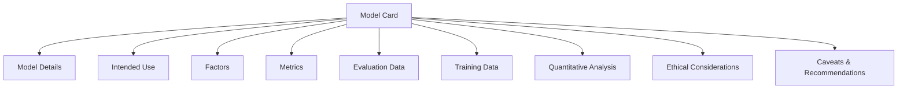
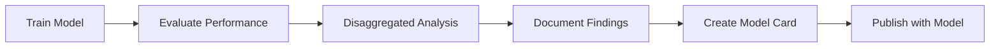

# Model Cards for Model Reporting

**Document Version:** 1.0  
**Generated:** December 4, 2025  
**Standard Origin:** Google Research (2019)  
**Status:** Emerging Best Practice

---

## Table of Contents

1. [Overview](#overview)
2. [Authoritative References](#authoritative-references)
3. [Format Structure](#format-structure)
4. [Procedural Use-Cases](#procedural-use-cases)
5. [Examples](#examples)
6. [Tools & Ecosystem](#tools--ecosystem)
7. [Best Practices](#best-practices)

---

## Overview

**Model Cards** are short documents accompanying trained machine learning models that provide benchmarked evaluation in a variety of conditions, such as across different cultural, demographic, or phenotypic groups (e.g., race, geographic location, sex, age) and intersectional groups that are relevant to the intended application domains.

### Key Features

- **Transparency**: Clear documentation of model capabilities and limitations
- **Accountability**: Track model lineage and responsible parties
- **Ethical AI**: Document bias testing and fairness considerations
- **Reproducibility**: Include training details and evaluation metrics
- **Governance**: Support regulatory compliance and auditing

### Primary Use Cases

1. **Model Documentation**: Comprehensive model metadata
2. **Bias Assessment**: Document performance across demographic groups
3. **Compliance**: Meet regulatory requirements (EU AI Act, etc.)
4. **Model Comparison**: Standardized comparison across models
5. **Risk Management**: Identify and communicate model limitations

---

## Authoritative References

### Original Paper
- **Title**: "Model Cards for Model Reporting"
- **Authors**: Margaret Mitchell, Simone Wu, et al. (Google)
- **Year**: 2019
- **Link**: https://arxiv.org/abs/1810.03993

### Implementation Guides
- **Model Card Toolkit (Google)**: https://github.com/tensorflow/model-card-toolkit
- **Hugging Face Model Cards**: https://huggingface.co/docs/hub/model-cards
- **Microsoft Model Card**: https://www.microsoft.com/en-us/ai/responsible-ai-resources

### Related Standards
- **EU AI Act**: Requires model documentation
- **IEEE 7000-2021**: Systems engineering for ethical concerns
- **ISO/IEC 23894**: AI Risk Management

---

## Format Structure

Model Cards can be represented in **Markdown**, **JSON**, or **YAML**. Most implementations use Markdown for human readability.

### Core Sections



### 1. Model Details

**Role**: Basic model information and provenance.

**Key Fields**:
- Model name and version
- Model type/architecture
- Organization/person developed
- Model date
- Model license
- Contact information
- Citation details

**Impact**: Establishes model identity and ownership.

### 2. Intended Use

**Role**: Defines appropriate use cases and users.

**Key Fields**:
- Primary intended uses
- Primary intended users
- Out-of-scope uses
- Use case examples

**Impact**: Prevents misuse and sets expectations.

### 3. Factors

**Role**: Relevant demographic/phenotypic factors.

**Key Fields**:
- Groups (age, gender, geography, etc.)
- Instrumentation (sensors, devices)
- Environment (lighting, weather, etc.)

**Impact**: Identifies performance variation factors.

### 4. Metrics

**Role**: Evaluation metrics used.

**Key Fields**:
- Model performance measures
- Decision thresholds
- Variation approaches (confidence intervals)

**Impact**: Quantifies model quality.

### 5. Evaluation Data

**Role**: Test set information.

**Key Fields**:
- Datasets used
- Motivation for dataset choice
- Preprocessing steps

**Impact**: Enables result reproduction.

### 6. Training Data

**Role**: Training set information.

**Key Fields**:
- Datasets used
- Data collection methods
- Preprocessing steps
- Data splits

**Impact**: Documents model foundations.

### 7. Quantitative Analysis

**Role**: Performance across factors.

**Key Fields**:
- Disaggregated evaluation
- Intersectional analysis
- Performance plots/tables

**Impact**: Reveals bias and limitations.

### 8. Ethical Considerations

**Role**: Ethical implications and risks.

**Key Fields**:
- Data privacy considerations
- Bias and fairness analysis
- Potential harms
- Mitigation strategies

**Impact**: Addresses responsible AI concerns.

### 9. Caveats and Recommendations

**Role**: Limitations and usage guidance.

**Key Fields**:
- Known limitations
- Edge cases
- Recommendations for use
- Monitoring guidance

**Impact**: Informs safe deployment.

---

## Procedural Use-Cases

### Use-Case 1: Creating a Model Card for Image Classification

**Goal**: Document a trained image classifier with bias analysis.

**Workflow**:



**Step-by-Step Procedure**:

1. **Collect Model Information**:
```python
model_info = {
    "name": "ResNet-50 ImageNet Classifier",
    "version": "1.0.0",
    "architecture": "ResNet-50",
    "framework": "PyTorch 2.0",
    "developed_by": "AI Research Lab",
    "date": "2025-12-04",
    "license": "Apache 2.0"
}
```

2. **Document Training**:
```python
training_info = {
    "dataset": "ImageNet-1K",
    "samples": 1281167,
    "preprocessing": [
        "Resize to 256x256",
        "Random crop 224x224",
        "Horizontal flip (p=0.5)",
        "Normalization (ImageNet stats)"
    ],
    "hyperparameters": {
        "batch_size": 256,
        "learning_rate": 0.1,
        "epochs": 90,
        "optimizer": "SGD with momentum"
    }
}
```

3. **Perform Disaggregated Evaluation**:
```python
# Evaluate across different lighting conditions
evaluation_results = {
    "overall": {"accuracy": 0.762, "top5_accuracy": 0.931},
    "by_lighting": {
        "bright": {"accuracy": 0.812, "top5_accuracy": 0.951},
        "normal": {"accuracy": 0.762, "top5_accuracy": 0.931},
        "dark": {"accuracy": 0.631, "top5_accuracy": 0.847}
    },
    "by_object_size": {
        "large": {"accuracy": 0.854, "top5_accuracy": 0.967},
        "medium": {"accuracy": 0.762, "top5_accuracy": 0.931},
        "small": {"accuracy": 0.591, "top5_accuracy": 0.821}
    }
}
```

4. **Generate Model Card**:
```markdown
# Model Card: ResNet-50 ImageNet Classifier v1.0.0

## Model Details

- **Developed by**: AI Research Lab
- **Model date**: December 2025
- **Model type**: Convolutional Neural Network (ResNet-50)
- **Model version**: 1.0.0
- **License**: Apache 2.0
- **Framework**: PyTorch 2.0.1
- **Paper**: [Deep Residual Learning for Image Recognition](https://arxiv.org/abs/1512.03385)
- **Contact**: ml-team@example.com

## Intended Use

### Primary Uses
- General-purpose image classification
- Feature extraction for transfer learning
- Research baseline for computer vision tasks

### Primary Users
- ML researchers
- Application developers
- Computer vision practitioners

### Out-of-Scope Uses
- Medical diagnosis without additional validation
- Security/surveillance without bias auditing
- High-stakes decision-making without human oversight
- Real-time critical systems (latency: ~45ms)

## Factors

### Groups
- Lighting conditions: bright, normal, dark
- Object sizes: small, medium, large
- Image quality: high-resolution, compressed
- Geographic diversity: tested on ImageNet distribution

### Instrumentation
- Tested on images from various cameras and devices
- JPEG compression levels: 75-100 quality

## Metrics

- **Accuracy**: Top-1 classification accuracy
- **Top-5 Accuracy**: Correct class in top 5 predictions
- **Inference Time**: Average milliseconds per image (on V100 GPU)
- **Model Size**: 98 MB (FP32)

## Evaluation Data

### Dataset
- **Name**: ImageNet-1K Validation Set
- **Size**: 50,000 images
- **Distribution**: 1000 classes, 50 images per class
- **Source**: http://www.image-net.org/

### Preprocessing
1. Resize shortest edge to 256 pixels
2. Center crop to 224×224
3. Normalize with ImageNet mean and std

## Training Data

### Dataset
- **Name**: ImageNet-1K Training Set
- **Size**: 1,281,167 images
- **Classes**: 1000 object categories
- **Collection**: Scraped from internet, annotated via Amazon Mechanical Turk

### Data Characteristics
- Geographic bias toward North American and European contexts
- Temporal bias (images from 2009-2011 era)
- Known class imbalances (ranging from 732 to 1300 images per class)

## Quantitative Analysis

### Overall Performance
| Metric | Value |
|--------|-------|
| Top-1 Accuracy | 76.2% |
| Top-5 Accuracy | 93.1% |
| Inference Time (GPU) | 45.2 ms |
| Inference Time (CPU) | 287 ms |

### Performance by Lighting Condition
| Condition | Top-1 Acc | Top-5 Acc |
|-----------|-----------|-----------|
| Bright | 81.2% | 95.1% |
| Normal | 76.2% | 93.1% |
| Dark | 63.1% | 84.7% |

**Finding**: Significant performance degradation in low-light conditions.

### Performance by Object Size
| Object Size | Top-1 Acc | Top-5 Acc |
|-------------|-----------|-----------|
| Large (>50% image) | 85.4% | 96.7% |
| Medium (20-50%) | 76.2% | 93.1% |
| Small (<20%) | 59.1% | 82.1% |

**Finding**: Model struggles with small objects, likely due to spatial resolution loss.

### Confusion Matrix Analysis
- Most common confusions: visually similar categories (e.g., dog breeds)
- Systematic errors: texture over shape bias observed

## Ethical Considerations

### Bias and Fairness
- **Geographic bias**: Model trained predominantly on Western imagery
- **Cultural bias**: Object categories reflect Western cultural context
- **Representation gaps**: Underrepresentation of objects from Global South

### Privacy
- Training data sourced from public internet
- Potential privacy concerns with incidentally captured individuals
- No explicit consent from people in images

### Potential Harms
- **Stereotyping**: May reinforce cultural stereotypes through category definitions
- **Misclassification impacts**: Errors in sensitive applications (e.g., content moderation)
- **Dual use**: Could be misused for surveillance without appropriate safeguards

### Mitigation Strategies
- Document known biases for downstream users
- Recommend additional validation for sensitive applications
- Provide disaggregated performance metrics

## Caveats and Recommendations

### Limitations
1. **Low-light performance**: Accuracy drops significantly in dark conditions
2. **Small object detection**: Poor performance on objects <20% of image area
3. **Domain shift**: Performance degrades on images significantly different from ImageNet
4. **Temporal drift**: Training data from 2009-2011 may not reflect current visual world
5. **Class imbalance**: Some categories have better representation than others

### Recommendations
1. **Fine-tuning**: Recommended for domain-specific applications
2. **Ensemble methods**: Consider combining with other models for robust performance
3. **Human oversight**: Required for high-stakes decisions
4. **Monitoring**: Track performance metrics in production
5. **Retraining**: Consider periodic retraining on more recent data

### Edge Cases
- Adversarial examples can cause misclassification
- Unusual viewing angles may reduce accuracy
- Heavily compressed or artifacted images show degraded performance

### Usage Guidelines
```python
# Good practice
prediction, confidence = model.predict(image)
if confidence < 0.7:
    flag_for_human_review(image, prediction)

# Bad practice (avoid)
# Using without confidence threshold
# Deploying without domain-specific validation
# Using for medical diagnosis without FDA clearance
```

## Model Card Authors
- Jane Doe (ML Engineer)
- John Smith (AI Ethics Researcher)
- Sarah Johnson (Data Scientist)

Last Updated: December 4, 2025
```

### Use-Case 2: Automated Model Card Generation

**Tool**: TensorFlow Model Card Toolkit

**Code Example**:
```python
from model_card_toolkit import ModelCardToolkit

# Initialize toolkit
mct = ModelCardToolkit()

# Create model card
model_card = mct.scaffold_assets()

# Populate model details
model_card.model_details.name = "ResNet-50 Classifier"
model_card.model_details.version.name = "1.0.0"
model_card.model_details.license = "Apache 2.0"
model_card.model_details.references = [
    "https://arxiv.org/abs/1512.03385"
]

# Add intended use
model_card.considerations.use_cases = [
    "General image classification",
    "Transfer learning feature extraction"
]
model_card.considerations.limitations = [
    "Reduced accuracy in low-light conditions",
    "Not suitable for medical diagnosis"
]

# Add quantitative analysis
from model_card_toolkit import Graphic

# Performance plot
model_card.quantitative_analysis.graphics.collection = [
    Graphic(
        name="Performance by Lighting",
        image="path/to/performance_plot.png"
    )
]

# Performance metrics
model_card.quantitative_analysis.performance_metrics = [
    {"type": "accuracy", "value": 0.762},
    {"type": "top_5_accuracy", "value": 0.931}
]

# Generate model card
mct.update_model_card(model_card)
html = mct.export_format()

print("Model card generated!")
```

---

## Examples

### Example 1: Complete Model Card (Markdown)

```markdown
# Model Card: Sentiment Analysis BERT

## Model Details
- **Developed by**: NLP Research Team
- **Model date**: December 2025
- **Model type**: BERT-base fine-tuned for sentiment analysis
- **Model version**: 2.1.0
- **License**: MIT
- **Framework**: Hugging Face Transformers
- **Contact**: nlp-team@example.com

## Intended Use
### Primary Uses
- Social media sentiment analysis
- Customer review classification
- Brand monitoring

### Primary Users
- Marketing analysts
- Social media managers
- Customer service teams

### Out-of-Scope Uses
- Medical or legal document analysis
- Content moderation without human review
- Languages other than English

## Factors
### Groups
- Age demographics (Gen Z, Millennials, Gen X, Boomers)
- Platform types (Twitter, Reddit, Reviews)
- Text formality (casual, formal, slang-heavy)

## Metrics
- **F1 Score**: Macro-averaged F1
- **Accuracy**: Overall classification accuracy
- **AUC-ROC**: Area under ROC curve
- **Fairness Metrics**: Demographic parity difference

## Training Data
- **Dataset**: Mixed corpus
  - IMDB Reviews: 50,000 samples
  - Twitter Sentiment: 1.6M tweets
  - Amazon Reviews: 400,000 reviews
- **Preprocessing**: Lowercase, remove URLs, emoji handling
- **Class distribution**: Positive 45%, Negative 35%, Neutral 20%

## Quantitative Analysis

### Overall Performance
| Metric | Value |
|--------|-------|
| Accuracy | 89.2% |
| F1 Score | 0.887 |
| AUC-ROC | 0.942 |

### Performance by Platform
| Platform | Accuracy | F1 Score |
|----------|----------|----------|
| Twitter | 87.3% | 0.861 |
| Reviews | 91.8% | 0.908 |
| Reddit | 88.1% | 0.873 |

### Fairness Analysis
Demographic parity difference across age groups: 0.043 (below 0.05 threshold)

## Ethical Considerations
- **Bias**: Slight bias toward formal language
- **Sarcasm detection**: Limited capability (58% accuracy on sarcastic text)
- **Cultural context**: Trained primarily on US English

## Caveats
- Performance degrades on text >512 tokens
- Emojis and emoticons may affect accuracy
- Domain adaptation recommended for specialized industries
```

### Example 2: JSON Model Card Schema

```json
{
  "model_details": {
    "name": "Image Segmentation U-Net",
    "version": "3.0.1",
    "description": "Medical image segmentation for organ detection",
    "architecture": "U-Net with ResNet34 encoder",
    "developed_by": "Medical AI Lab",
    "date": "2025-12-04",
    "license": "CC BY-NC 4.0",
    "contact": "medical-ai@hospital.org"
  },
  "intended_use": {
    "primary_uses": [
      "Liver segmentation in CT scans",
      "Research tool for medical imaging"
    ],
    "primary_users": ["Radiologists", "Medical researchers"],
    "out_of_scope": [
      "Primary diagnostic tool without radiologist review",
      "Pediatric imaging (not validated)",
      "Real-time intraoperative use"
    ]
  },
  "factors": {
    "groups": ["Adult patients (18-80 years)", "CT scanner types", "Contrast vs non-contrast"],
    "instrumentation": ["Siemens SOMATOM", "GE Revolution CT", "Philips iCT"],
    "environment": ["Hospital setting", "Radiology department"]
  },
  "metrics": [
    {"name": "Dice Score", "description": "Overlap between prediction and ground truth"},
    {"name": "IoU", "description": "Intersection over Union"},
    {"name": "Hausdorff Distance", "description": "Boundary accuracy"}
  ],
  "training_data": {
    "datasets": [
      {
        "name": "LiTS Challenge Dataset",
        "size": 131,
        "url": "https://competitions.codalab.org/competitions/17094"
      },
      {
        "name": "Internal Hospital Dataset",
        "size": 450,
        "description": "IRB approved, de-identified CT scans"
      }
    ],
    "preprocessing": [
      "Resampling to 1mm × 1mm × 1mm",
      "Intensity windowing (40, 400 HU)",
      "Z-score normalization"
    ]
  },
  "quantitative_analysis": {
    "overall": {
      "dice_score": 0.947,
      "iou": 0.901,
      "hausdorff_distance_mm": 2.3
    },
    "by_scanner": {
      "Siemens": {"dice": 0.952, "iou": 0.909},
      "GE": {"dice": 0.945, "iou": 0.897},
      "Philips": {"dice": 0.943, "iou": 0.894}
    },
    "by_contrast": {
      "contrast_enhanced": {"dice": 0.961, "iou": 0.925},
      "non_contrast": {"dice": 0.933, "iou": 0.876}
    }
  },
  "ethical_considerations": {
    "privacy": "All training data de-identified per HIPAA",
    "bias": "Underrepresentation of pediatric and elderly patients",
    "fairness": "Performance tested across scanner vendors",
    "potential_harms": [
      "False negatives could delay treatment",
      "False positives may cause unnecessary procedures"
    ],
    "mitigation": [
      "Always used with radiologist oversight",
      "Uncertainty quantification included in output",
      "Regular performance monitoring required"
    ]
  },
  "caveats": {
    "limitations": [
      "Not validated for pediatric patients (<18 years)",
      "Performance degrades with severe liver disease",
      "Requires contrast-enhanced CT for best results"
    ],
    "recommendations": [
      "Use as decision support tool only",
      "Requires clinical validation before deployment",
      "Monitor performance on institution-specific data",
      "Retrain with local data for optimal performance"
    ]
  }
}
```

---

## Tools & Ecosystem

### Model Card Creation

| Tool | Description | Homepage |
|------|-------------|----------|
| **Model Card Toolkit** | TensorFlow official toolkit | https://github.com/tensorflow/model-card-toolkit |
| **Hugging Face Hub** | Integrated model card editor | https://huggingface.co/docs/hub/model-cards |
| **Model Card Generator** | Template-based generator | https://modelcards.withgoogle.com/about |
| **scikit-learn** | Model card support (experimental) | https://scikit-learn.org/ |

### Validation & Analysis

| Tool | Description | Homepage |
|------|-------------|----------|
| **Fairlearn** | Fairness assessment | https://fairlearn.org/ |
| **AI Fairness 360** | IBM bias detection | https://aif360.mybluemix.net/ |
| **What-If Tool** | Model probing | https://pair-code.github.io/what-if-tool/ |
| **Explainable AI** | Google Cloud tool | https://cloud.google.com/explainable-ai |

### Compliance & Governance

| Tool | Description | Homepage |
|------|-------------|----------|
| **Azure ML** | Responsible AI dashboard | https://azure.microsoft.com/en-us/products/machine-learning/ |
| **Vertex AI** | Google Cloud ML governance | https://cloud.google.com/vertex-ai |
| **SageMaker** | AWS model cards | https://aws.amazon.com/sagemaker/ |

---

## Best Practices

### 1. Regular Updates
```markdown
## Version History
- v1.0.0 (2025-01-15): Initial release
- v1.1.0 (2025-06-20): Added bias mitigation
- v2.0.0 (2025-12-04): Architecture update, retrained on expanded dataset
```

### 2. Include Visualizations
```python
import matplotlib.pyplot as plt

# Create performance plot
plt.figure(figsize=(10, 6))
plt.bar(factors, accuracies)
plt.title("Model Performance Across Factors")
plt.xlabel("Factor")
plt.ylabel("Accuracy")
plt.savefig("performance_by_factor.png")
```

### 3. Link to Related Documents
```markdown
## Related Documentation
- [Technical Paper](./paper.pdf)
- [API Documentation](./api-docs.md)
- [Training Code](https://github.com/org/repo)
- [Datasheet for Dataset](./datasheet.md)
```

### 4. Use Templates
```python
# Load template
from model_card_toolkit import ModelCardToolkit

mct = ModelCardToolkit()
template = mct.scaffold_assets()

# Customize and populate
template.model_details.name = "My Model"
# ... fill in details ...

# Export
mct.export_format(template_path="custom_template.html.jinja")
```

---

**Navigation**: [Back to Index](../INDEX.md) | [Previous: OpenAPI for AI Services](./03-OpenAPI-AI-Services.md) | [Next: TensorFlow Serving](./05-TensorFlow-Serving.md)
