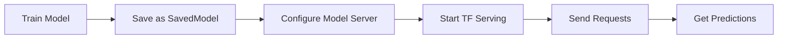

# TensorFlow Serving

**Document Version:** 1.0  
**Generated:** December 4, 2025  
**Standard:** TensorFlow Serving Protocol  
**Status:** Production Standard

---

## Table of Contents

1. [Overview](#overview)
2. [Authoritative References](#authoritative-references)
3. [Format Structure](#format-structure)
4. [Procedural Use-Cases](#procedural-use-cases)
5. [Examples](#examples)
6. [Tools & Ecosystem](#tools--ecosystem)
7. [Best Practices](#best-practices)

---

## Overview

**TensorFlow Serving** is a flexible, high-performance serving system for machine learning models, designed for production environments. It enables deployment of TensorFlow models, SavedModels, and models from other frameworks (via adapters) with support for versioning, A/B testing, and dynamic model loading.

### Key Features

- **SavedModel Format**: Universal TensorFlow model representation
- **gRPC/REST APIs**: Multiple protocol support
- **Model Versioning**: Run multiple model versions simultaneously
- **Dynamic Loading**: Hot-load new models without restarting
- **Batching**: Automatic request batching for performance
- **Distributed Serving**: Scale across multiple servers
- **Monitoring**: Built-in metrics and logging

### Primary Use Cases

1. **Production Model Deployment**: Serve trained TensorFlow models
2. **Multi-Model Serving**: Run multiple models on same server
3. **Versioning & Rollback**: A/B test different model versions
4. **Real-Time Inference**: Low-latency predictions
5. **Batch Prediction**: Process multiple requests efficiently

---

## Authoritative References

### Official Documentation
- **TensorFlow Serving Guide**: https://www.tensorflow.org/tfx/serving/serving_basic
- **gRPC Interface**: https://github.com/tensorflow/serving/tree/master/tensorflow_serving/apis
- **GitHub Repository**: https://github.com/tensorflow/serving
- **Model Server API**: https://github.com/tensorflow/serving/blob/master/tensorflow_serving/apis

### Related Standards
- **SavedModel Format**: https://www.tensorflow.org/guide/saved_model
- **gRPC Protocol**: See [08-gRPC-ML-Serving.md](./08-gRPC-ML-Serving.md)
- **Protocol Buffers**: https://protobuf.dev/

---

## Format Structure

### SavedModel Directory Structure

**Abstract Component Relationships:**

A SavedModel is a self-contained serialization of a trained model. It bundles everything needed to reload and run the model without the original training code:

```
SavedModel Package
├── Graph Definition (saved_model.pb)
│     Defines the computation graph — the sequence of mathematical
│     operations (layers, activations, loss functions) that transform
│     input tensors into output tensors. This is the model's "blueprint."
│
├── Learned Weights (variables/)
│     Stores the trained parameter values (weights and biases) that the
│     graph operates on. Sharded into .data files (raw float values) and
│     an .index file (lookup table mapping variable names → shard offsets).
│     Together with the graph, these reproduce the trained model exactly.
│
├── External Assets (assets/)
│     Holds supplementary files the graph references at inference time —
│     e.g., vocabulary lookup tables, label maps, or tokenizer configs.
│     The graph contains ops that read from this directory by convention.
│
└── Framework Metadata (keras_metadata.pb)  [optional]
      Preserves high-level Keras abstractions (layer names, compile args,
      optimizer state) so the model can be reloaded as a Keras object,
      not just a raw TensorFlow graph.

Relationship: Graph Definition REFERENCES Variables by name.
             Graph Definition READS Assets via file-reading ops.
             Framework Metadata ANNOTATES the Graph with higher-level info.
```

**Concrete directory layout:**

```
saved_model/
├── assets/                          # Additional files
├── variables/
│   ├── variables.data-00000-of-00001
│   └── variables.index
├── saved_model.pb                   # Graph definition
└── keras_metadata.pb               # Keras-specific metadata
```

### Serving Configuration

**Pseudo-structure** (model_config_lists.config):
```
model_config_list {
  config {
    name: "model_1"
    base_path: "/models/model_1"
    model_platform: "tensorflow"
    model_version_policy {
      specific {
        versions: 1
        versions: 2
      }
    }
  }
  config {
    name: "model_2"
    base_path: "/models/model_2"
    model_platform: "tensorflow"
  }
}
```

### Model Metadata

**Real example** (model.pbtxt):
```protobuf
name: "resnet50"
platform: "tensorflow"
input {
  name: "image"
  data_type: DT_FLOAT
  tensor_shape {
    dim {
      size: -1
    }
    dim {
      size: 224
    }
    dim {
      size: 224
    }
    dim {
      size: 3
    }
  }
}
output {
  name: "predictions"
  data_type: DT_FLOAT
  tensor_shape {
    dim {
      size: -1
    }
    dim {
      size: 1000
    }
  }
}
version {
  version: 1
  state: AVAILABLE
}
```

---

## Procedural Use-Cases

### Use-Case 1: Deploy TensorFlow Model to Serving

**Workflow**:


**Step-by-Step**:

1. **Save Model** (Python):
```python
import tensorflow as tf

# Train model
model = tf.keras.Sequential([
    tf.keras.layers.Conv2D(32, 3, activation='relu', input_shape=(224, 224, 3)),
    tf.keras.layers.GlobalAveragePooling2D(),
    tf.keras.layers.Dense(1000, activation='softmax')
])

model.compile(optimizer='adam', loss='sparse_categorical_crossentropy')
# Train...

# Save as SavedModel
model.save('/models/resnet50/1')  # Version 1
```

2. **Configure Model Server**:
```bash
# Create config file
cat > /models/models.config << EOF
model_config_list {
  config {
    name: "resnet50"
    base_path: "/models/resnet50"
    model_platform: "tensorflow"
  }
}
EOF
```

3. **Start Serving** (Docker):
```bash
docker run -p 8500:8500 -p 8501:8501 \
  --mount type=bind,source=/models,target=/models \
  -e MODEL_NAME=resnet50 \
  tensorflow/serving:latest
```

4. **Send Requests** (gRPC):

**Abstract Request Lifecycle — gRPC Predict API:**
```
ALGORITHM: gRPC_Predict_Request_Lifecycle
INPUT:  server_address, model_name, input_data
OUTPUT: prediction_result

PROCEDURE:
  // Phase 1 — CONNECT
  channel  ← open_gRPC_channel(server_address)    // Establish HTTP/2 connection
  stub     ← create_prediction_stub(channel)       // Bind to PredictionService

  // Phase 2 — BUILD REQUEST
  request  ← new PredictRequest()
  request.model_spec.name    ← model_name          // Which model to invoke
  request.model_spec.version ← desired_version     // (optional) pin a version
  request.inputs["input_tensor"] ← serialize_to_tensor_proto(input_data)
      // Converts native array → TensorProto (dtype + shape + raw bytes)

  // Phase 3 — CALL (synchronous or async)
  response ← stub.Predict(request, timeout=deadline)
      // Wire format: request is serialized to Protobuf, sent over HTTP/2,
      //   server deserializes, runs graph, serializes response back.

  // Phase 4 — PARSE RESPONSE
  output_tensor ← response.outputs["output_tensor"]
  prediction    ← deserialize_tensor_proto(output_tensor)  // → native array
  RETURN prediction
END ALGORITHM
```

**Concrete implementation** (Python + gRPC):
```python
import grpc
from tensorflow_serving.apis import predict_pb2, prediction_service_pb2_grpc
import numpy as np

channel = grpc.aio.secure_channel('localhost:8500')
stub = prediction_service_pb2_grpc.PredictionServiceStub(channel)

# Prepare request
request = predict_pb2.PredictRequest()
request.model_spec.name = 'resnet50'
request.inputs['image'].CopyFromNumpy(np.random.rand(1, 224, 224, 3).astype(np.float32))

# Get prediction
response = stub.Predict(request)
print(response.outputs['predictions'])
```

### Use-Case 2: Model Versioning & Canary Deployment

**Configuration**:
```protobuf
model_config_list {
  config {
    name: "sentiment"
    base_path: "/models/sentiment"
    model_platform: "tensorflow"
    model_version_policy {
      specific {
        versions: 1  # Current version
        versions: 2  # New version for testing
      }
    }
  }
}
```

**Routing** (pseudocode):
```python
def route_request(request, version_routing):
    """
    Route request to specific model version
    version_routing: {model_name: version_id}
    """
    if request.model_name in version_routing:
        request.model_spec.version.value = version_routing[request.model_name]
    return make_prediction(request)

# 90% traffic to v1, 10% to v2
version_routing = {
    'sentiment': 1 if random() < 0.9 else 2
}
```

### Use-Case 3: Batch Processing

**Configuration**:
```protobuf
batching_parameters {
  max_batch_size: 32
  batch_timeout_micros: 100000
  pad_variable_length_inputs: true
}
```

**Implementation** (pseudocode):
```
ALGORITHM: BatchingManager
INPUT: incoming requests
OUTPUT: batched predictions

PROCEDURE:
  batch = []
  
  WHILE requests available DO
    // Collect requests
    IF batch.size < max_batch_size AND time_elapsed < timeout THEN
      batch.append(request)
    ELSE
      // Execute batch
      predictions = model.predict(batch)
      FOR each prediction in predictions DO
        send_response(prediction)
      END FOR
      batch = []
    END IF
  END WHILE
END ALGORITHM
```

---

## Examples

### Example 1: Complete Serving Setup (Docker Compose)

```yaml
version: '3'
services:
  tensorflow-serving:
    image: tensorflow/serving:latest
    ports:
      - "8500:8500"  # gRPC
      - "8501:8501"  # REST
    volumes:
      - ./models:/models
      - ./config/models.config:/models/models.config
    environment:
      - MODEL_CONFIG_FILE=/models/models.config
      - MODEL_CONFIG_FILE_POLL_WAIT_SECONDS=60
    command: >
      --port=8500
      --rest_api_port=8501
      --model_config_file=/models/models.config
      --file_system_poll_wait_seconds=60

  prometheus:
    image: prom/prometheus:latest
    ports:
      - "9090:9090"
    volumes:
      - ./config/prometheus.yml:/etc/prometheus/prometheus.yml
    command:
      - '--config.file=/etc/prometheus/prometheus.yml'

  grafana:
    image: grafana/grafana:latest
    ports:
      - "3000:3000"
    depends_on:
      - prometheus
```

### Example 2: REST API Request/Response

**Abstract REST API Contract:**

TensorFlow Serving exposes a REST endpoint whose contract follows a fixed pattern regardless of model type:

```
┌──────────────────────────────────────────────────────────┐
│  ENDPOINT PATTERN                                        │
│  POST  http://{host}:{port}/v1/models/{model}:predict    │
│  POST  http://{host}:{port}/v1/models/{model}/versions/  │
│            {version}:predict                             │
├──────────────────────────────────────────────────────────┤
│  REQUEST SCHEMA                                          │
│  {                                                       │
│    "signature_name": "<serving_signature>",  // optional │
│    "instances": [                            // row fmt  │
│       <instance_1>,  // each matches model input shape   │
│       <instance_2>,                                      │
│       ...                                                │
│    ]                                                     │
│    // ── OR ──                                           │
│    "inputs": {                               // col fmt  │
│       "<input_name>": [ <values...> ]                    │
│    }                                                     │
│  }                                                       │
├──────────────────────────────────────────────────────────┤
│  RESPONSE SCHEMA                                         │
│  {                                                       │
│    "predictions": [        // one per instance           │
│       <prediction_1>,      // shape matches model output │
│       <prediction_2>,                                    │
│       ...                                                │
│    ]                                                     │
│  }                                                       │
├──────────────────────────────────────────────────────────┤
│  ERROR SCHEMA                                            │
│  {                                                       │
│    "error": "<human-readable message>"                   │
│  }                                                       │
│  HTTP status: 400 (bad input) / 404 (model not found)    │
│               500 (internal) / 503 (model unavailable)   │
└──────────────────────────────────────────────────────────┘

Notes:
 • "instances" format sends each example as a complete object (row-oriented).
 • "inputs" format sends each named input as a full column (column-oriented).
 • Only one of "instances" or "inputs" may appear in a single request.
```

**Request** (Real JSON):
```json
{
  "instances": [
    {
      "text": "This movie is absolutely amazing! I loved it.",
      "metadata": {
        "user_id": "user123",
        "timestamp": "2025-12-04T10:30:00Z"
      }
    }
  ]
}
```

**Response** (Real JSON):
```json
{
  "predictions": [
    {
      "class": "positive",
      "confidence": 0.9847,
      "probabilities": {
        "negative": 0.0065,
        "neutral": 0.0088,
        "positive": 0.9847
      },
      "model_version": "3"
    }
  ]
}
```

### Example 3: Python Client

```python
import requests
import json
import numpy as np

class TFServingClient:
    def __init__(self, host='localhost', rest_port=8501):
        self.url = f'http://{host}:{rest_port}/v1/models'
    
    def predict(self, model_name, instances, signature_name='serving_default'):
        """Make prediction request"""
        url = f'{self.url}/{model_name}:predict'
        
        data = {
            'signature_name': signature_name,
            'instances': instances
        }
        
        response = requests.post(url, json=data)
        return response.json()
    
    def get_model_status(self, model_name):
        """Get model status"""
        url = f'{self.url}/{model_name}'
        response = requests.get(url)
        return response.json()
    
    def list_models(self):
        """List all served models"""
        response = requests.get(self.url)
        return response.json()

# Usage
client = TFServingClient()

# Make prediction
result = client.predict(
    'resnet50',
    [[np.random.rand(224, 224, 3).tolist()]]
)
print(result)

# Check model status
status = client.get_model_status('resnet50')
print(f"Model state: {status['model_spec']['state']}")

# List all models
models = client.list_models()
print(f"Available models: {models}")
```

---

## Tools & Ecosystem

### Deployment

| Tool | Description | Homepage |
|------|-------------|----------|
| **TensorFlow Serving** | Official serving system | https://www.tensorflow.org/tfx/serving |
| **TFX Orchestrator** | End-to-end ML pipeline | https://www.tensorflow.org/tfx |
| **Kubernetes** | Container orchestration | https://kubernetes.io/ |
| **Docker** | Containerization | https://www.docker.com/ |

### Monitoring & Observability

| Tool | Description | Homepage |
|------|-------------|----------|
| **Prometheus** | Metrics collection | https://prometheus.io/ |
| **Grafana** | Visualization | https://grafana.com/ |
| **Jaeger** | Distributed tracing | https://www.jaegertracing.io/ |
| **ELK Stack** | Logging | https://www.elastic.co/elastic-stack |

### Client Libraries

| Language | Library | Docs |
|----------|---------|------|
| **Python** | TensorFlow Serving API | https://www.tensorflow.org/tfx/serving/serving_basic |
| **Java** | TensorFlow Serving Client | https://github.com/tensorflow/serving |
| **Go** | Go gRPC Client | https://github.com/tensorflow/serving |
| **Node.js** | Node.js TF Serving | https://github.com/tensorflow/tfjs |

---

## Best Practices

### 1. Model Organization
```
/models/
├── model_1/
│   ├── 1/                    # Version 1
│   │   ├── saved_model.pb
│   │   ├── variables/
│   │   └── assets/
│   ├── 2/                    # Version 2
│   └── 3/                    # Version 3 (latest)
└── model_2/
    └── 1/
```

### 2. Performance Tuning
```bash
# Enable batching
--enable_batching=true
--batching_parameters_file=batching.config

# Tune thread pools
--tensorflow_inter_op_parallelism=2
--tensorflow_intra_op_parallelism=8

# Enable GPU
--tensorflow_session_parallelism=32
--per_process_gpu_memory_fraction=0.8
```

### 3. Health Checks
```python
def health_check():
    """Verify model serving health"""
    try:
        response = client.get_model_status('model_name')
        return response['model_spec']['state'] == 'AVAILABLE'
    except:
        return False
```

### 4. Error Handling
```python
def safe_predict(client, model_name, data, timeout=5):
    """Robust prediction with error handling"""
    try:
        result = client.predict(model_name, data)
        return result
    except grpc.RpcError as e:
        if e.code() == grpc.StatusCode.DEADLINE_EXCEEDED:
            logging.warning(f"Request timeout for {model_name}")
        return None
    except Exception as e:
        logging.error(f"Prediction error: {e}")
        return None
```

---

**Navigation**: [Back to Index](../INDEX.md) | [Previous: Model Cards](./04-Model-Cards.md) | [Next: MLflow](./06-MLflow.md)
